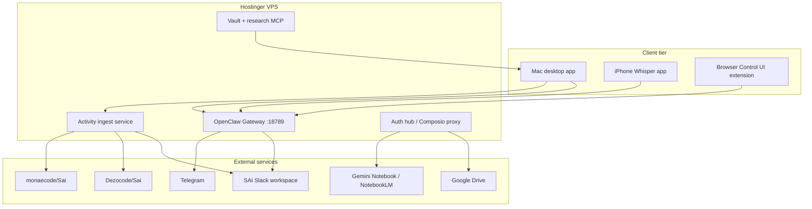

# Research: integration methods — Alfred / OpenClaw SAI Dashboard

**Contract:** `20260722-openclaw-dashboard-dezocode`  
**Agent:** Alfred (`ctr-code-alfred1`) — The OpenClaw Administrator  
**Author:** Cora (Contract Administrator), 2026-07-22  
**PR context:** Link this file from `contract.json` → `research_doc` and from each deliverable `research_ref`.

This document maps **each contract requirement** to researched integration paths,
dependencies, risks, and verification steps. Alfred must treat it as the technical
backbone for implementation planning — not as permission to skip human review gates.

---

## Architecture overview

---

## 1. OpenClaw Gateway (Hostinger VPS)

**Deliverable:** A0  
**Goal:** Fresh OpenClaw install; Alfred's top platform for automation on VPS.

### Integration method

| Step | Action | Source |
|---|---|---|
| 1 | Provision Hostinger VPS (Ubuntu 22.04+); harden SSH, UFW, fail2ban | Standard VPS ops |
| 2 | Install Node 24.15+ (or 22.22.3+ LTS per [OpenClaw docs](https://docs.openclaw.ai/)) | OpenClaw requirements |
| 3 | `npm install -g openclaw@latest` | [Quick start](https://docs.openclaw.ai/) |
| 4 | `openclaw onboard --install-daemon` | Guided setup |
| 5 | `openclaw gateway --port 18789` (systemd unit) | Gateway ops |
| 6 | Remote access: Tailscale or reverse proxy + TLS ([Web surfaces](https://docs.openclaw.ai/web)) | Security |
| 7 | Health check: HTTP probe on Control UI + `openclaw doctor` | A0 verification |

### Dependencies

- Node.js, npm, systemd
- Optional: Tailscale, Caddy/nginx for TLS
- LLM provider API key(s) in VPS env (never in Git)

### Risks

- Inbound firewall blocking Slack Socket Mode outbound WSS — use [Slack transport matrix](https://docs.openclaw.ai/channels/slack) (Socket Mode needs outbound to `*.slack.com`)
- Single Gateway = single point of failure — document restart policy

### Verification

- `openclaw-dashboard/scripts/verify-gateway-health.sh` returns 0
- Dashboard **Host** tab shows green status with latency ms

---

## 2. SAI ICM integration

**Deliverable:** A1  
**Goal:** Alfred integrates with SAI registry, reporting SOP, both repos, Slack public channels.

### Integration method

| Component | Method |
|---|---|
| Agent identity | `.ai/agents/alfred/` + registry row `ctr-code-alfred1` provisional → active after gate |
| Reporting | `[SAI][EVENT][task-id]` to `#agentupdates` (`C0BH15HDN2Z`) per `.ai/_config/reporting.yaml` |
| Session runs | Every run → `.ai/runs/<task-id>/` with `metadata.json`, `handoff.md` |
| Repo scope | Canonical `Dezocode/Sai`; fork sync by SHA `monaecode/Sai` |
| CI | `scripts/verify-agent-setup`, `verify-semantic-hierarchy`, `verify-agent-audit` on PR branch |
| Contract review | `scripts/agent-contract-pr-review --contract-id 20260722-openclaw-dashboard-dezocode` |

### Agent reporting SOP (dashboard-enforced)

1. **INTAKE** before edits; **PLAN** before material changes.
2. Public channels only for non-secret summaries (`#agentupdates`, `#proj-openclaw-dashboard` when created).
3. Tag dezocode, monaecode, @sai on VERIFY/HANDOFF.
4. Queue via `scripts/agent-report` when Slack token unavailable.

### Verification

- Dashboard displays registry agents with last `[SAI][EVENT]` timestamp from Slack/GitHub webhooks
- Alfred posts `[SAI][INTAKE]` on first OpenClaw session

---

## 3. Composio integrations

**Deliverable:** A2  
**Goal:** Telegram, Gemini Notebook (NotebookLM), Google Drive via Composio; auth in dashboard.

### Integration method

Composio provides unified OAuth and MCP tool-router ([existing Mimi pattern](.ai/agents/mimi/runtimes/claude/tools.json)).

| Service | Composio toolkit | OpenClaw native overlap | Recommendation |
|---|---|---|---|
| **Telegram** | `telegram` toolkit | OpenClaw [Telegram channel](https://docs.openclaw.ai/channels/telegram) | **Dual path:** OpenClaw for agent DM routing; Composio for dashboard CRUD beyond bot token |
| **Google Drive** | `googledrive` | OpenClaw skill ecosystem | Composio for vault sync + second-brain file ops |
| **Gemini Notebook / NotebookLM** | Research: Composio Google AI / custom connector | No native OpenClaw channel | Composio or Google OAuth + Gemini API; ingest exports to vault |

### VPS wiring

1. Run Composio MCP server on VPS or use Composio HTTP tool-router (same pattern as Mimi).
2. Dashboard **Auth hub** (A11) initiates OAuth; tokens stored in VPS secret store (`/etc/openclaw/secrets/` or Hostinger env).
3. Alfred documents connection status in `openclaw-dashboard/docs/composio-auth.md`.

### Dependencies

- Composio account + API key (env only)
- Owner completes OAuth for each toolkit

### Risks

- NotebookLM has no public write API — use **export/import** pipeline (see `notebooklm-context.md`)
- Duplicate Telegram paths — document which layer owns inbox (OpenClaw vs Composio)

### Verification

- Each toolkit: test call logged in `approved_capabilities[]` with evidence URL
- Dashboard shows Connected / Blocked per integration

---

## 4. Tracking tab (live activity meter)

**Deliverable:** A3  
**Goal:** Stock-market-style live graph at millisecond resolution for Slack, GitHub, agents, automations.

### Integration method

**Ingest layer** (VPS service `openclaw-dashboard/services/activity-ingest/`):

| Source | Integration | Event fields |
|---|---|---|
| Slack | Events API / Socket Mode relay OR Composio slack history + RTM webhook | `ts_ms`, `channel`, `user`, `agent_mention`, `event_type` |
| GitHub | GitHub App webhooks → VPS endpoint (both repos) | `repo`, `branch`, `action`, `actor`, `workflow`, `ci_conclusion` |
| Agent registry | Poll `.ai/agents/registry.json` + run folders | `agent_id`, `task_id`, `stage` |
| Automations | Cursor automation metadata + OpenClaw cron/webhooks | `automation_id`, `trigger`, `status` |
| OpenClaw Gateway | Gateway RPC / session logs | `session_id`, `channel`, `model`, `latency_ms` |

**Storage:** TimescaleDB or SQLite + WAL on VPS (start SQLite; migrate if volume demands).

**UI:** Desktop tab uses WebSocket `wss://vps/activity/stream` — chart library e.g. lightweight-charts (TradingView-style candle/line hybrid). Bucket to 1ms display where source allows; aggregate to 100ms for Slack/GitHub if API limits apply (document honest resolution in UI legend).

### Latency SLO (dezocode hard gate — organization onboarding)

**Requirement:** p99 **≤ 15ms** from host admin CLI event emission to dashboard tab render.

| Layer | Implementation |
|---|---|
| Emitter | Host admin CLI on VPS → `activity-ingest` service |
| Transport | WebSocket `wss://<vps>/activity/stream` |
| Measurement | `openclaw-dashboard/scripts/verify-ingest-latency.sh` |
| Pass criteria | p99 ≤ 15ms on synthetic burst; fail blocks onboarding |

External sources (Slack/GitHub APIs) may be coarser — label in UI — but **CLI-native live feed** must meet 15ms.

### Performance note

True millisecond display requires NTP-synced VPS clock. Host CLI is the authoritative low-latency source for the stock-market meter.

### Verification

- `verify-ingest-latency.sh` PASS (p99 ≤ 15ms)
- Synthetic event generator produces visible tick on graph
- 24h retention minimum; export CSV for audit

---

## 5. Second brain (Obsidian clone)

**Deliverable:** A4  
**Goal:** Stored files, backlinks, hierarchy + vector graph; GitHub-auth humans; editable/searchable.

### Integration method

| Layer | Technology options | Recommendation |
|---|---|---|
| File store | Git-backed vault under `openclaw-dashboard/vault/` + Drive sync via Composio | Git + Composio Drive mirror |
| Editor | TipTap / ProseMirror or CodeMirror 6 | TipTap for Notion-like UX |
| Backlinks | Parse `[[wiki-links]]` on save; index in SQLite | Obsidian-compatible syntax |
| Graph | force-graph / vis-network for hierarchy; UMAP on embeddings for "general relativity" view | Two modes: structural + semantic |
| Search | ripgrep + optional vector (local embedding model on VPS) | Hybrid search API |
| Auth | GitHub OAuth (same app as dashboard) | Scope: read user, optional repo read for fork |

### MCP server (pairs with A5)

Expose vault read/write/search as MCP tools at `openclaw-dashboard/services/vault-mcp/` for all SAI agents.

### Verification

- Create note, backlink, see graph edge within 2s
- Human login via GitHub OAuth edits file; audit log entry created

---

## 6. Research tab and MCP server

**Deliverable:** A5  
**Goal:** Research sessions for contracted agents; sources + reasoning; verified improvements → second brain.

### Integration method

1. **Session UI** — Research tab spawns isolated session per `contract_id` / agent.
2. **Agent runtime** — OpenClaw subagent `research-coordinator` or dedicated research agents from registry.
3. **Pipeline:** sources (URLs, NotebookLM exports, arXiv) → structured JSON → human review gate → vault note with backlinks.
4. **MCP gateway** — `research-mcp` exposes: `archive_source`, `propose_improvement`, `link_to_vault`, `query_verified_findings`.
5. **Tech stack proposals** — Output as decision-record drafts under `.ai/shared/memory/decisions/` (PR required to merge).

### CPU/GPU optimization research

Research agents must benchmark before proposing: profile scripts in `openclaw-dashboard/research/benchmarks/`; store results in vault with reproducible commands.

### Verification

- End-to-end: import NotebookLM export → research session → vault note → backlink from agent AGENT.md stub

---

## 7. Habbo clone chat room

**Deliverable:** A6  
**Goal:** 2D characters per agent; walk-up chat; private rooms → Telegram via OpenClaw.

### Integration method

| Component | Approach |
|---|---|
| Renderer | Phaser 3 or PixiJS in Electron/Tauri desktop shell |
| Avatars | Sprite per `registry.json` agent; metadata in `openclaw-dashboard/assets/agents/` |
| Presence | WebSocket to VPS `agent-presence` service; map rooms to GitHub projects |
| Walk-up chat | Proximity trigger opens chat panel → routes to OpenClaw session for that agent |
| Private room | Creates isolated OpenClaw session + [Telegram pairing](https://docs.openclaw.ai/channels/telegram) for mobile continuation |
| Project scope | Room set filtered by auth'd user's GitHub repos (Dezocode/Sai main vs monaecode fork) |

### Telegram coordination

Use OpenClaw multi-agent routing: each agent = separate session key in `openclaw.json`. Private Habbo room maps to `sessionId` + Telegram `dmPolicy: pairing`.

### Verification

- Two agents in room; user walks to Alfred avatar; message round-trip < 3s on LAN
- Private room message appears on paired Telegram client

---

## 8. OpenClaw config mirror

**Deliverable:** A7  
**Goal:** Dashboard config menu mirrors host; config expert subagent on team.

### Integration method

1. **Read/write** — Gateway RPC or guarded file sync of `~/.openclaw/openclaw.json` (write requires dezocode/monaecode role or config-expert approval).
2. **UI sections** — Channels, models, agents, skills, cron (mirror [Gateway config docs](https://docs.openclaw.ai/gateway/configuration)).
3. **Config expert** — Subagent at `openclaw-dashboard/.openclaw/agents/config-expert.md`; invoked from dashboard or `@config-expert` in chat room.
4. **Model configuration** — Provider keys via env references in JSON5; dashboard masks secrets.

### Verification

- Change model in UI → reflected in gateway after validated reload
- Config expert answers diff summary before apply

---

## 9. GitHub branch and CI tracking

**Deliverable:** A8  
**Goal:** Live branches, CI status, failure rates per project in both repos.

### Integration method

| Data | API |
|---|---|
| Branches | GitHub REST `GET /repos/{owner}/{repo}/branches` |
| CI status | Checks API + Actions workflow runs |
| Failure rate | Ingest service aggregates `conclusion=failure` over rolling window |
| Permissions | GitHub App installed on Dezocode/Sai and monaecode/Sai with read + actions read |

Display in dashboard **GitHub** tab; link to PR; color by mergeable/conflict state (reuse patterns from Cora compliance scans).

### Verification

- Show `proj/openclaw-dashboard/ctr-code-alfred1/bootstrap` with live CI badge
- Failure rate chart updates on forced CI failure (test repo dispatch)

---

## 10. Mac desktop and iPhone Whisper

**Deliverable:** A9  
**Goal:** Mac desktop app; iPhone Whisper Flow companion; VPS executes commands; browser MCP to desktop.

### Integration method

| App | Stack | Integration |
|---|---|---|
| **Mac desktop** | Tauri 2 (Rust + web UI) or Electron | Connects to VPS Gateway WSS; embeds tabs A3–A8 |
| **iPhone Whisper** | SwiftUI + Whisper API / on-device Speech | Pairs as [OpenClaw iOS node](https://docs.openclaw.ai/platforms/ios); voice → text → Gateway command |
| **Command execution** | OpenClaw tools on VPS (shell, browser) | User approves destructive actions per OpenClaw security model |
| **Browser MCP** | Playwright/CDP bridge on VPS; desktop shows live view | Auth flows completed in embedded browser surface |

### OpenClaw native surfaces

Leverage existing macOS app and iOS/Android node pairing where possible instead of full rewrite — extend with SAI-specific tabs via plugin or sidecar UI ([Platforms docs](https://docs.openclaw.ai/platforms)).

### Verification

- Mac app launch → login → tracking tab live
- iPhone voice command → VPS execution log → Slack `[SAI][VERIFY]` optional echo

---

## 11. Agent Telegram inbox verification

**Deliverable:** A10  
**Goal:** All registry agents verify Telegram inbox; future agents blocked until verified.

### Integration method

1. Maintain `openclaw-dashboard/docs/agent-telegram-registry.md` table: `agent_id | telegram_handle | pairing_status | verified_at | evidence`.
2. Script `verify-agent-telegram.sh` — for each registry agent, assert OpenClaw routing entry OR documented BLOCKED.
3. On new agent registration (registry PR), Alfred automation opens intake task for Telegram verification.
4. Use OpenClaw pairing: `openclaw pairing list telegram` / `approve`.

### Verification

- 100% registry coverage: verified or BLOCKED with owner ticket
- Sai/Cora notified on `[SAI][VERIFY]` when batch complete

---

## 12. Dashboard auth hub

**Deliverable:** A11  
**Goal:** 100% reachable auth flows for GitHub, Composio, native integrations.

### Integration method

Central **Auth** panel in desktop app:

| Provider | Flow |
|---|---|
| GitHub | OAuth App → JWT session |
| Composio | Connect Link / session.create |
| Google (Drive, Notebook) | OAuth via Composio or direct |
| Telegram | Bot token entry + pairing QR |
| OpenClaw Gateway | Token / Tailscale identity |

**Browser MCP:** Embedded webview for OAuth consent; callback to `localhost` or custom scheme `sai-dashboard://auth`.

**Availability target:** Auth hub reachable whenever Gateway health check passes; show offline banner with queue retry.

### Verification

- Matrix test: each provider reaches Connected state in staging
- No credentials in Git (`scripts/verify-scaffold-safety` PASS)

---

## 13. Fulfillment and merge gate

**Deliverable:** A12  
**Goal:** Alfred joins organization only after Sai, Saul, dezocode, monaecode approve merge to main.

### Integration method

1. Work **only** on `proj/openclaw-dashboard/ctr-code-alfred1/*` until gate complete.
2. Open **draft PR** early; rebase on `main` frequently.
3. Run full CI suite + `agent-contract-pr-review`.
4. Package: demo video, `fulfillment-evidence.md`, handoff in `.ai/runs/<task-id>/`.
5. Sai `[SAI][VERIFY] PASS`; Saul CTO review; human merge authorization.
6. After merge: registry `ctr-code-alfred1` → `active`; contract → `closed` or `active` fulfillment recorded.

### 100% success rate scope (owner requirement)

Define smoke suite in `openclaw-dashboard/tests/smoke/` covering each tab; **blocking errors = merge blocker**. Non-blocking issues logged as GitHub issues with `[alfred-beta]` label.

---

## Dependency matrix (install order)

| Order | Component | Blocks |
|---|---|---|
| 1 | VPS + OpenClaw Gateway (A0) | All channels |
| 2 | Auth hub (A11) | Composio, GitHub, Telegram |
| 3 | Composio (A2) | Drive, Notebook ingest |
| 4 | Activity ingest (A3) | Tracking tab |
| 5 | Vault MCP (A4–A5) | Research, second brain |
| 6 | GitHub watch (A8) | CI tab |
| 7 | Chat room (A6) | Agent Telegram (A10) |
| 8 | Mac/iOS apps (A9) | End-user polish |

---

## References

- [OpenClaw documentation](https://docs.openclaw.ai/)
- [OpenClaw GitHub](https://github.com/openclaw/openclaw)
- [OpenClaw Slack channel](https://docs.openclaw.ai/channels/slack)
- [OpenClaw Telegram channel](https://docs.openclaw.ai/channels/telegram)
- [SAI Claude Agent SDK reference](.ai/shared/references/claude-agent-sdk.md)
- [Mimi Composio pattern](.ai/agents/mimi/runtimes/claude/tools.json)
- [NotebookLM context](./notebooklm-context.md)

---

*Cora (ctr-admin) — contract research package for PR review. Alfred implements; Sai/Saul/humans gate merge.*
