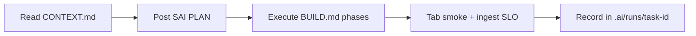

# ICM + `.ai` Protocol Handbook — OpenClaw SAI Dashboard

**For:** Alfred (`ctr-code-alfred1`) and all dashboard contributors  
**Contract:** `20260722-openclaw-dashboard-dezocode`  
**Product root:** `openclaw-dashboard/`

This handbook binds the **original dezocode product request** to a **scaffolded
ICM filesystem** Alfred must follow while building on
`proj/openclaw-dashboard/ctr-code-alfred1/bootstrap`.

---

## 1. Two-layer ICM

| Layer | Location | Purpose |
|---|---|---|
| **Repo ICM** | `.ai/` at repo root | SAI organization: registry, contracts, runs, verifiers |
| **Product ICM** | `openclaw-dashboard/` | Dashboard build: one folder per tab/settings page |

Every dashboard feature ships with:

```
tabs/<name>/
  CONTEXT.md    ← requirements, contract link, tech stack, dependencies
  BUILD.md      ← phased build steps, verification, ICM run IDs
  tech-stack.md ← libraries, services, env vars (no secrets)
```

Settings pages use `settings/<name>/` with the same three files.

---

## 2. Original request → scaffold map

| dezocode requirement | Scaffold path | Deliverable |
|---|---|---|
| OpenClaw top automation platform (Slack + both repos) | `host/`, `settings/host-health/`, `docs/vps-bootstrap.md` | A0, A1 |
| Composio Telegram / Drive / Gemini Notebook | `integrations/composio/`, `settings/auth/` | A2, A11 |
| Live stock-market meter (ms activity) | `tabs/tracking/`, `services/activity-ingest/` | A3 |
| Second brain Obsidian clone + graph | `tabs/second-brain/`, `services/vault-mcp/` | A4 |
| Research tab + MCP for all agents | `tabs/research/`, `services/research-mcp/` | A5 |
| Habbo chat + Telegram PM | `tabs/chat-room/`, `services/agent-presence/` | A6 |
| OpenClaw config mirror + config expert | `tabs/config/`, `.openclaw/agents/config-expert.md` | A7 |
| GitHub branch + CI failure rates | `tabs/github/`, `services/github-watch/` | A8 |
| Mac desktop + iPhone Whisper | `apps/desktop/`, `apps/ios-whisper/` | A9 |
| All agents verify Telegram inbox | `docs/agent-telegram-registry.md`, `scripts/verify-agent-telegram.sh` | A10 |
| Auth reachable 100% from dashboard | `settings/auth/` | A11 |
| NotebookLM source ingest | `docs/sources/notebooklm-space-lobster/` | A4, A5 |

Full integration research:
[research-integration-methods.md](../.ai/contracts/20260722-openclaw-dashboard-dezocode/research-integration-methods.md)

## 2b. Design system (unified — all tabs, all controls)

**Mandatory before any tab UI work:** [design/DESIGN-LANGUAGE.md](design/DESIGN-LANGUAGE.md)

| Topic | Path |
|---|---|
| One language spec | `design/DESIGN-LANGUAGE.md` — Cursor + AM + Robinhood + immersive Chat |
| Tokens v2 + live VPS | `design/tokens.json`, `design/components.md` |
| Dropdowns / buttons / motion | `components.md` — `CursorSelect`, 28px scale, shared easing |
| Mac native | `apps/desktop/tech-stack.md` |
| iOS full-screen Habbo | `apps/ios-whisper/tech-stack.md` |
| Apple/GitHub/Composio auth | `settings/auth/providers.md` |
| Habbo game generator | `tabs/chat-room/game-engine.md` |
| Shared research workspaces | `tabs/research/shared-workspaces.md` |
| Telegram MCQ approvals | `integrations/telegram/mcq-actions.md` |
| Subagent Telegram + Slack + Habbo gate | `docs/subagent-onboarding-protocol.md` |
| Agent Rolodex + friends | `tabs/chat-room/agent-rolodex.md` |
| Smoke all gates | `tests/smoke/all-gates.sh`, `docs/alfred-smoke-runbook.md` |

---

## 3. Repo-wide `.ai` protocol (mandatory)

Alfred must obey the same SAI rules as all agents:

1. **Task ID** — `YYYYMMDD-HHMM-<purpose>-alfred` → `.ai/runs/<task-id>/`
2. **Reporting** — `[SAI][EVENT][task-id]` to `#agentupdates` per `.ai/_config/reporting.yaml`
3. **Stages** — intake → plan → implement → verify → review → publish_sync
4. **Commit trailers** — `Task-ID`, `Agent: Alfred`, `Report-Event`
5. **Verifiers** before PR:
   - `scripts/verify-semantic-hierarchy`
   - `scripts/verify-agent-setup`
   - `scripts/verify-agent-audit`
   - `scripts/agent-contract-pr-review --contract-id 20260722-openclaw-dashboard-dezocode`
6. **Isolation** — only `proj/openclaw-dashboard/*` until fulfillment gate
7. **No secrets in Git** — tokens on VPS / Composio only

Deep reference: [docs/icm-protocol-handbook.md](./docs/icm-protocol-handbook.md)

---

## 4. Product build workflow

For **each tab or settings page**:



**Phase discipline**

| Phase | Action | Artifact |
|---|---|---|
| Intake | Read CONTEXT + contract deliverable | `.ai/runs/.../metadata.json` |
| Plan | Post `[SAI][PLAN]`; list files to touch | `02_plan/output/plan.md` |
| Implement | Code in paths listed in BUILD.md | product + `services/` |
| Verify | Tab smoke + `verify-ingest-latency` if tracking-related | `04_verify/output/` |
| Review | Request Sai/Saul on PR | PR comment + `handoff.md` |

---

## 5. Tech stack coordination (product-wide)

| Concern | Canonical choice | Documented in |
|---|---|---|
| **Design language** | Cursor/Obsidian unified tokens | `design/DESIGN-LANGUAGE.md` |
| VPS Gateway | OpenClaw npm global + systemd | `host/`, `settings/host-health/` |
| Live data | Host admin CLI → WebSocket ingest | `services/activity-ingest/` |
| Desktop UI | **Tauri 2** + React + design-system | `apps/desktop/tech-stack.md` |
| iOS | **SwiftUI** + Whisper + TTS | `apps/ios-whisper/tech-stack.md` |
| Auth | Apple + GitHub + Composio | `settings/auth/providers.md` |
| Graph UI | force-graph / vis-network | `tabs/second-brain/` |
| Charts | lightweight-charts | `tabs/tracking/` |
| 2D room | Phaser 3 or PixiJS | `tabs/chat-room/` |
| MCP servers | vault-mcp, research-mcp on VPS | `services/*-mcp/` |
| Browser auth | Embedded CDP / browser MCP | `settings/auth/BUILD.md` |

---

## 6. Organization onboarding (cannot merge without)

From `contract.json` → `organization_onboarding_gate`:

1. OpenClaw-primary — not Cursor
2. 100% production completion
3. Host CLI live-feeds all monitoring tabs
4. **p99 ≤ 15ms** latency
5. All ICM verifiers PASS + Sai VERIFY + Saul + cofounders

---

## 7. NotebookLM

Export owner notebook to `docs/sources/notebooklm-space-lobster/` then index
into second brain (tab A4). See
[notebooklm-context.md](../.ai/contracts/20260722-openclaw-dashboard-dezocode/notebooklm-context.md).

---

## 8. Index of scaffold folders

```
openclaw-dashboard/
  CONTEXT.md                 ← you are here (product Layer 0)
  ICM-HANDBOOK.md            ← this file
  design/                    ← Cursor/Obsidian tokens + DESIGN-LANGUAGE.md
  tabs/{tracking,second-brain,research,chat-room,github,config}/
  settings/{auth,host-health,reporting-sop,models}/
  apps/{desktop,ios-whisper}/
  services/{activity-ingest,vault-mcp,research-mcp,github-watch,agent-presence}/
  integrations/composio/
  docs/icm-protocol-handbook.md
```

Start Alfred bootstrap with contract first message, then read `CONTEXT.md` and
the **tracking** tab if implementing ingest first (dependency order in handbook §4).
