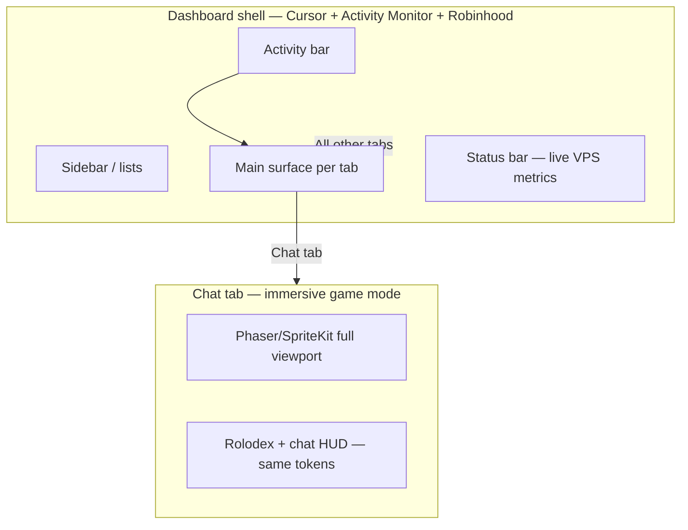

# Design language — SAI Dashboard (one system, all surfaces)

**Applies to:** Main dashboard shell, **every tab**, **every settings page**, **every
button**, dropdown, menu, animation, and interaction — Mac desktop and iOS companion.  
**Tokens:** [tokens.json](./tokens.json)  
**Components:** [components.md](./components.md)  
**Live data:** All metrics, graphs, rolodex activity age, presence, and ingest streams
are **VPS-hosted** via `services/activity-ingest/` and tab WebSockets — never stale
mock data in production.

---

## Design intent

One **design language** governs the entire app. No tab may invent its own typography,
control sizes, motion curves, or color palette. The aesthetic is a deliberate blend:

| Influence | Where it shows | What we borrow |
|---|---|---|
| **Cursor Desktop** | Shell chrome, tabs, sidebar, editor panels, buttons, inputs | `#1e1e1e` base, `#007acc` accent, 13px UI, 35px tabs, 28px controls |
| **Activity Monitor** | Tracking, host-health, GitHub CI, process-style lists | Dense rows, sortable columns, live CPU/latency bars, mono timestamps |
| **Robinhood** | Tracking meter, sparklines, live tickers | Large metric numerals, green/red delta, smooth live chart animation |
| **Notion** | Second brain, research, config forms | Block spacing, hover affordances, subtle transitions, clear hierarchy |
| **Habbo (game)** | Chat room tab only — **immersive full-screen** | Pixel/isometric room fills viewport; HUD overlays use dashboard tokens |



---

## Hard rules

| Rule | Detail |
|---|---|
| **One token source** | Import only from `design/tokens.json` / `DesignTokens.swift` — zero inline hex in tab code |
| **One control scale** | Buttons 28px, inputs 28px, dropdowns 28px, tab bar 35px — same on Mac and iOS |
| **One motion system** | `motion.durationFast/Normal/Slow` + shared easing — no per-tab animation curves |
| **One interaction bar** | Hover, focus, press, disabled, loading states on every interactive control |
| **Live VPS data** | Graphs, rolodex activity age, gateway health, ingest p99 — WebSocket from VPS |
| **Immersive exception** | Chat room **only** may enter full-screen game layout; HUD chrome still uses tokens |

---

## Layout modes

### Mode A — `shell` (default: all tabs except Chat)

Standard Cursor-style workspace. Activity Monitor lists and Robinhood metrics live
**inside** this shell — they do not break the chrome.

```
┌──┬──────────┬─────────────────────────────────────┬──────────┐
│ A│ Sidebar  │  Tab bar (35px, Cursor-style)       │ Optional │
│ c│ lists /  ├─────────────────────────────────────┤  panel   │
│ t│ file tree│  Main surface                       │          │
│ i│          │  (graph / editor / AM table / form) │          │
│ v│          ├─────────────────────────────────────┤          │
│ i│          │  Bottom panel (terminal / MCQ / log)│          │
│ t│          └─────────────────────────────────────┘          │
├──┴──────────┴─────────────────────────────────────┴──────────┤
│ Status bar: Gateway ● live  ingest p99  GitHub  Slack  user   │
└───────────────────────────────────────────────────────────────┘
```

**Activity bar order (fixed):** Tracking | Second brain | Research | Chat | GitHub | Config | Settings

### Mode B — `immersive-game` (Chat room tab only)

The **2D Habbo room fills the screen** like a video game — on **Mac and iOS**. This is
not a small panel; it is the primary viewport for the Chat tab.

| Region | Behavior |
|---|---|
| **Game canvas** | Edge-to-edge below tab bar (Mac) or safe-area full bleed (iOS); Phaser 3 desktop, Phaser WKWebView or SpriteKit iOS |
| **Minimal chrome** | Thin top bar: room name, back-to-lobby, friends — 35px, same tab tokens |
| **HUD overlays** | Agent Rolodex slides from left; chat transcript from bottom — **same 13px/28px tokens**, not game-engine default UI |
| **Sidebar collapse** | Activity bar remains; editor sidebar auto-hides in immersive mode (toggle restores) |

Mac: Tauri window content area = game viewport.  
iOS: Chat tab is **full-screen game first**; text chat is a sheet overlay, not a replacement for the room.

---

## Typography (single scale)

| Role | Size | Weight | Color token | Use |
|---|---|---|---|---|
| Body UI | 13px | 400 | `text.primary` | Labels, table cells, menu items |
| Body medium | 13px | 500 | `text.primary` | Tab labels active, button labels |
| Caption / age | 11px | 400 mono | `text.secondary` | Activity age, AM timestamps, graph axis |
| Metric hero | 28px | 600 | `text.primary` | Robinhood-style live counters (tracking) |
| Metric delta | 13px | 500 | `graphUp` / `graphDown` | +/- change beside hero metric |
| Editor | 13px | 400 | `text.primary` | Second brain, research, config |
| Monospace log | 12px | 400 mono | `text.secondary` | Ingest, terminal, CI logs |

**Font stacks:** SF Pro / system UI; SF Mono for data. iOS uses identical sizes from generated `DesignTokens.swift`.

---

## Controls — ratio, placement, dropdowns

All controls share **4px grid** spacing (`spacing.unit`).

| Control | Height | Padding X | Radius | Placement rule |
|---|---|---|---|---|
| Primary button | 28px | 12px | 4px | Primary action right-aligned in toolbars |
| Secondary button | 28px | 12px | 4px | Secondary actions left of primary |
| Ghost / icon button | 28×28px | 4px | 4px | Toolbar clusters; 8px gap between icons |
| Text input | 28px | 8px | 4px | Full width in forms; max 480px in modals |
| **Dropdown / select** | 28px | 8px | 4px | Chevron 12px right; menu aligns flush below trigger |
| Dropdown menu | auto | 4px item pad | 6px | Max height 320px scroll; shadow `elevation.menu` |
| Tab | 35px | 12px | 0 | Bottom border 2px accent when active |
| Toggle | 20×12px track | — | 6px | Label 13px left, 8px gap |
| Search field | 28px | 8px + icon | 4px | Rolodex, sidebar filter — same `CursorInput` |

**Dropdown placement:** open downward unless viewport clip → flip upward. 4px gap from trigger. Keyboard: ↑↓ navigate, Enter select, Esc dismiss.

---

## Motion & interactivity (Cursor / Notion bar)

| Interaction | Spec |
|---|---|
| Hover (buttons, rows) | Background `ghostHover` / `rowHover`, 120ms |
| Focus | 2px ring `border.focus`, offset 1px — keyboard only |
| Press | Scale 0.98, 80ms, restore on release |
| Toggle / tab switch | Cross-fade content 200ms; tab indicator slide 200ms |
| Panel slide (rolodex, sidebar) | 320ms ease-out; spring on iOS optional if token-matched |
| Live graph tick | Robinhood-style smooth scroll; new point pulse 15ms flash on `graph.livePulseMs` |
| Metric count-up | 400ms ease when VPS pushes new aggregate |
| Skeleton loading | Shimmer `surface.elevated` → `surface`, 1.2s loop |
| Toast / MCQ card | Slide up from bottom panel 200ms |

**Notion-like blocks:** second-brain and research use 8px vertical rhythm between blocks; hover shows `⋯` handle at block gutter — same ghost button token.

**No jank:** 60fps target on Mac; ProMotion-friendly on iOS. Game canvas runs independent loop; HUD overlays use dashboard motion tokens only.

---

## Tab surfaces (same language, different content)

| Tab | Main surface | AM influence | Robinhood influence | Layout mode |
|---|---|---|---|---|
| Tracking | Live graph + hero metric | Process-style event list below graph | Large p99/ms ticker, green/red delta | `shell` |
| Second brain | Markdown editor | — | — | `shell` |
| Research | Session + shared workspace | Source list density | — | `shell` |
| **Chat room** | **Full-screen Phaser/SpriteKit** | — | — | **`immersive-game`** |
| GitHub | Branch table + CI sparklines | Sortable failure-rate table | Sparkline per branch | `shell` |
| Config | JSON5 form | — | — | `shell` |
| Settings/* | Forms + health panels | Host-health = AM process table | Gateway latency badge | `shell` |

---

## Live data (VPS-hosted)

Every live element subscribes to VPS services — **no static placeholders in production**.

| UI element | VPS source | Update path |
|---|---|---|
| Tracking graph | `activity-ingest` | WebSocket `ingest/stream` |
| Hero metric (ms) | `activity-ingest` aggregates | Same stream + 1s rollup |
| Status bar p99 | `scripts/verify-ingest-latency` host CLI | Poll 5s |
| Agent Rolodex activity age | `activity-ingest` per `agent_id` | WebSocket |
| Habbo presence | `agent-presence` | WebSocket position + room |
| GitHub CI rates | `github-watch` | Poll 60s + push on failure |
| Gateway health | OpenClaw Gateway `/health` | Poll 10s |

Disconnected VPS → amber status dot + `LiveDataBadge` "Reconnecting…" — never fake numbers.

---

## Shared component library

See [components.md](./components.md). All tabs compose from:

`AppShell`, `TabBar`, `ActivityBar`, `StatusBar`, `CursorButton`, `CursorInput`,
`CursorSelect`, `LiveGraph`, `MetricHero`, `ProcessTable`, `ObsidianEditor`,
`GraphPanel`, `EmbeddedBrowser`, `ImmersiveGameShell`, `GameCanvas`, `AgentRolodex`,
`ChatTranscript`, `McqActionCard`, `LiveDataBadge`.

iOS: mirror every component in `apps/ios-whisper/DesignSystem/` from `tokens.json`.

---

## Platform stack

| Platform | Stack |
|---|---|
| **macOS** | Tauri 2 + React 19 + TypeScript + token-driven Tailwind |
| **iOS** | SwiftUI + Observation; `DesignTokens.swift` generated from `tokens.json` |
| **Game** | Phaser 3 full viewport (Mac); Phaser WKWebView or SpriteKit full screen (iOS) |
| **Charts** | lightweight-charts + Robinhood motion on live series |
| **Browser** | VPS CDP → `EmbeddedBrowser` |

---

## Verification

```bash
openclaw-dashboard/tests/smoke/design-tokens.sh      # token import gate
openclaw-dashboard/tests/smoke/design-compliance.sh  # layout + motion checks
```

Per-tab BUILD.md Phase 0: read this file before any UI work.

See [design-compliance.md](../tests/smoke/design-compliance.md).
