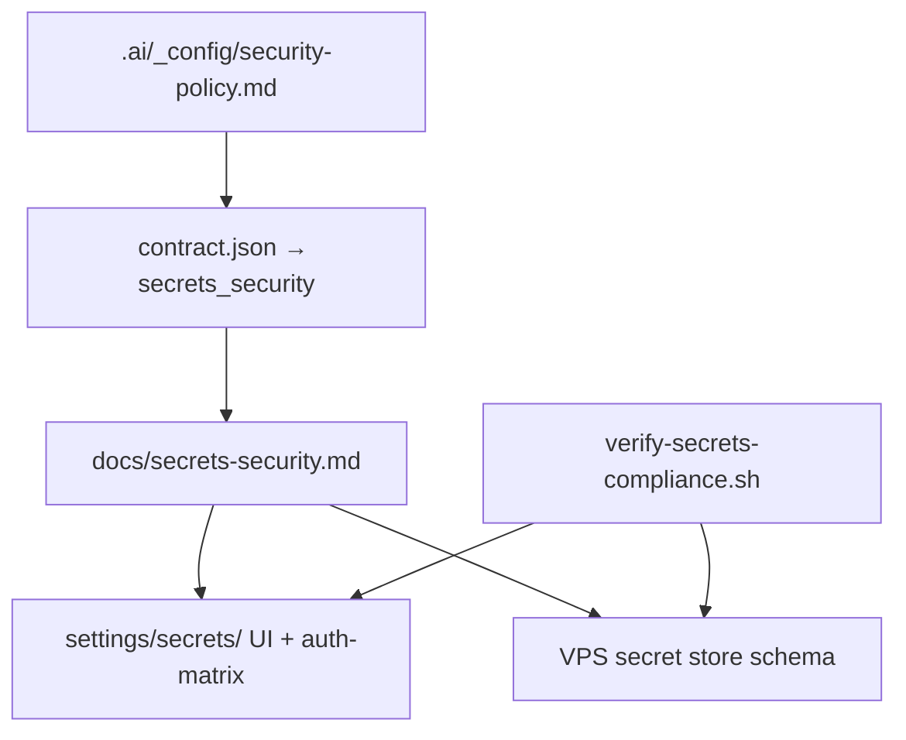

# Secrets security — OpenClaw SAI Dashboard (binding)

**Contract:** `20260722-openclaw-dashboard-dezocode`  
**Repo policy:** `.ai/_config/security-policy.md`  
**PR #45 governs:** this document + `settings/secrets/` + `docs/auth-matrix.md` + VPS schema

PR #45 is the **controlling specification** for how secrets are structured, stored,
accessed, and verified across OpenClaw Gateway, the dashboard, and ICM runs.
**No credential values belong in Git — ever.**

---

## Control hierarchy



| Layer | Location | Controls |
|---|---|---|
| **L0 Org** | `.ai/_config/security-policy.md` | Never commit/post secrets; human approval gates |
| **L1 Contract** | `contract.json` → `secrets_security` | Required stores, env names, smoke gates |
| **L2 Product** | This file + `auth-matrix.md` | Provider × env var × store path (no values) |
| **L3 Dashboard** | `settings/secrets/` | Masked UI, rotation SOP, BLOCKED tickets |
| **L4 VPS** | `secrets-store.schema.json` | OpenClaw + Composio + ingest paths on Hostinger |
| **L5 Verify** | `scripts/verify-secrets-compliance.sh` | Git scan + schema + .gitignore patterns |

---

## Secret store topology (VPS only)

| Store | Path | Contents |
|---|---|---|
| **OpenClaw Gateway** | `~/.openclaw/openclaw.json` | Channel tokens by reference; **values from env** |
| **SAI env file** | `/etc/openclaw/sai.env` (0600 root) | `SAI_*`, `OPENCLAW_*`, Composio keys |
| **Composio session** | Composio cloud + local cache | OAuth refresh tokens — never Git |
| **Desktop/iOS** | macOS Keychain / iOS Keychain | User session tokens only |
| **Telegram session** | `~/.openclaw/sessions/` | **Redacted** transcripts — no bot tokens |
| **Dashboard mirror** | In-memory + encrypted VPS DB | Auth hub status — not plaintext export |

Schema: `.ai/agents/alfred/runtimes/openclaw/gateway/config/secrets-store.schema.json`

---

## Environment variable registry (names only — set on VPS)

| Env var | Provider | Required for | Dashboard surface |
|---|---|---|---|
| `OPENCLAW_GATEWAY_TOKEN` | OpenClaw | Gateway auth | settings/secrets |
| `TELEGRAM_BOT_TOKEN` | Telegram | Alfred + fleet DMs | settings/auth + secrets |
| `SLACK_APP_TOKEN` | Slack | Socket Mode | settings/secrets |
| `SLACK_BOT_TOKEN` | Slack | `agent-report` / OpenClaw | settings/secrets |
| `COMPOSIO_API_KEY` | Composio | Drive, Notebook toolkits | settings/auth |
| `GITHUB_OAUTH_CLIENT_ID` | GitHub | Human OAuth | settings/auth |
| `GITHUB_OAUTH_CLIENT_SECRET` | GitHub | Human OAuth | VPS only — never client |
| `SAI_SLACK_BOT_TOKEN` | SAI | ICM reporting | VPS / CI secret |
| `TAILSCALE_AUTH_KEY` | Tailscale | Remote dashboard (optional) | settings/secrets |

Full matrix: [auth-matrix.md](./auth-matrix.md) — **status columns only, no values**.

---

## Git forbidden patterns

Never commit:

- `.env`, `.env.*`, `*.pem`, `*credentials*`, `openclaw.json` with tokens
- `sai.env`, `/etc/openclaw/` copies, Composio JSON with keys
- Telegram bot tokens, Slack `xox*` tokens, GitHub `ghp_*` / `github_pat_*`
- NotebookLM session cookies, Google OAuth refresh JSON

Enforced by:

```bash
scripts/verify-semantic-hierarchy          # repo-wide .ai/ scan
openclaw-dashboard/scripts/verify-secrets-compliance.sh
openclaw-dashboard/tests/smoke/secrets-compliance.sh
```

Product `.gitignore`: [openclaw-dashboard/.gitignore](../.gitignore)

---

## Dashboard secrets settings (A11 + secrets panel)

Route: `/settings/secrets`

| UI element | Behavior |
|---|---|
| Provider list | From `auth-matrix.md` — Connected / Pending / BLOCKED |
| Secret slots | Show env var **name** + last-rotated date — **never value** |
| Masked preview | `••••••••` + copy-disabled |
| Rotate action | MCQ to dezocode via Telegram + `[SAI][CHANGE]` before VPS edit |
| Export | **Forbidden** — no download of secret bundle |

Build: [settings/secrets/BUILD.md](../settings/secrets/BUILD.md)

---

## OpenClaw config mirror (A7) — secret references only

Dashboard config tab displays JSON5 with:

```json5
{
  "channels": {
    "telegram": { "botToken": "${TELEGRAM_BOT_TOKEN}" },
    "slack": { "appToken": "${SLACK_APP_TOKEN}" }
  }
}
```

Alfred `config-expert` must reject writes that inline literal tokens.

---

## ICM run artifacts

| Artifact | Secret rule |
|---|---|
| `.ai/runs/*/handoff.md` | Redact tokens; reference env var names only |
| `telegram-session.jsonl` | Redacted — BEHAVIORS.md B3 |
| `04_verify/output/*` | No `ss` output with auth headers; gateway-exposure.txt OK |
| Slack `[SAI][EVENT]` | `agent-report` redaction patterns |

---

## Rotation & incident

1. Suspected leak → `[SAI][BLOCKED]` + rotate on VPS + update auth-matrix status
2. Rotation requires dezocode or monaecode MCQ approval (Telegram + Slack)
3. Post rotation: `verify-secrets-compliance.sh` PASS; no values in Git history on branch

---

## Verification (Alfred bootstrap)

```bash
openclaw-dashboard/scripts/verify-secrets-compliance.sh
openclaw-dashboard/tests/smoke/secrets-compliance.sh
scripts/verify-scaffold-safety
```

Fulfillment evidence: `docs/fulfillment-evidence.md` → `secrets-compliance.log`
