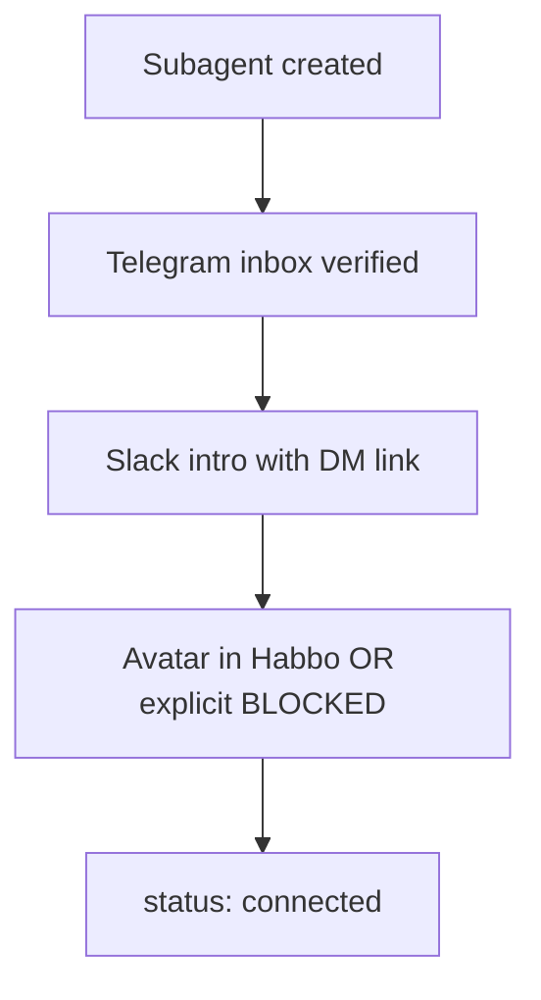

# Subagent onboarding protocol — Telegram, Slack, Habbo

**Applies to:** Every OpenClaw subagent created by **Alfred**, by **users in the
dashboard**, or registered in `.ai/agents/registry.json`.

**Contract:** A6 (chat), A10 (Telegram), design_system  
**Hard rule:** No subagent is **connected** in the SAI stack until all three gates pass.

---

## Three-connection gate (mandatory)



| Gate | Requirement | Evidence |
|---|---|---|
| **1. Telegram inbox** | Dedicated bot route or paired DM; listed in `docs/agent-telegram-registry.md` | `pairing_status: verified` |
| **2. Slack introduction** | Agent posts intro in approved **public** channel with Telegram deep link | Slack permalink in registry |
| **3. Habbo presence** | Sprite in ≥1 room OR personal room; appears in **Agent Rolodex** | `habbo_presence: connected` |

Until all three: dashboard shows **disconnected** — gray avatar, no walk-up chat.

---

## 1. Telegram inbox (every subagent)

### Who must comply

- Alfred (`ctr-code-alfred1`)
- OpenClaw subagents: `config-expert`, `research-coordinator`, any user-created agent
- Future registry agents (`registry.json` row)

### Provisioning (Alfred automation)

1. Allocate OpenClaw routing key: `agents.<agent_id>`
2. Configure Telegram in `~/.openclaw/openclaw.json` (VPS — never commit)
3. Run `openclaw pairing list telegram` → approve
4. Record in `docs/agent-telegram-registry.md`:

```markdown
| agent_id | display_name | telegram_dm_link | pairing_status | verified_at | slack_intro_link |
```

**telegram_dm_link** format: `https://t.me/<bot>?start=<agent_id>` or direct `@handle` deep link.

### User-created subagents (dashboard)

When user creates subagent in Config or Chat tab:

1. Wizard **step 3** = Telegram inbox (required field)
2. Cannot save without verified pairing or BLOCKED ticket with owner MCQ

---

## 2. Slack self-introduction (public channel)

Every new subagent posts **once** to `#agentupdates` (or `#proj-openclaw-dashboard` when live):

```
[SAI][INTRO][<task-id>]
Actor: <Display Name> (`<agent_id>`)
Role: <one line>
Telegram DM: <clickable link>
Habbo room: <room name> | personal room: <link in chat tab>
Repository: Dezocode/Sai
I am online for SAI coordination. Mention @<slack mapping if any> or message on Telegram.
```

Tag dezocode, monaecode, @sai.

**Registry field:** `slack_intro_permalink` — required for `connected` status.

---

## 3. Habbo chat rooms + personal rooms + friends

### Room types

| Room type | ID pattern | Who appears |
|---|---|---|
| **Shared branch** | `branch/<branch-name>` | Agents assigned to that branch |
| **GitHub project** | `proj/<project-slug>` | Contract contractors + staff |
| **Personal room** | `personal/<agent_id>` | That agent + **friends** only |
| **Lobby** | `lobby-sai` | All connected agents |

Generator: `services/agent-presence/room-generator.ts` (see [game-engine.md](../tabs/chat-room/game-engine.md)).

### Friends system

- Any human user (GitHub auth) can **friend** an agent from Agent Rolodex
- Agent can **friend** other agents (Alfred configures in Gateway)
- Personal room door visible in friends list when agent is `connected`
- Telegram DM used when user enters private room from personal space

### Connection rule

> Every subagent **must** either:
> - Appear as a walkable avatar in at least one room, **or**
> - Hold `habbo_presence: blocked` with remediation — **and still** have Telegram + Slack intro

Default: auto-place new agents in `lobby-sai` + their `personal/<agent_id>` room.

---

## 4. Agent Rolodex (every agent, activity age)

**UI location:** Chat tab sidebar — `AgentRolodex` component  
**Design:** Same Cursor tokens — 13px font, 28px row height, status dot 6px

### Row fields

| Field | Source | Display |
|---|---|---|
| Name | registry `name` | 13px medium `#cccccc` |
| Status | connected / disconnected / busy | dot: green / gray / amber |
| Activity age | last event from ingest | `2m`, `1h`, `3d` mono 11px `#969696` |
| Telegram | registry | link icon → opens DM |
| Room | presence service | door icon → jump to room |

**Activity age** = time since last:

- `[SAI][EVENT]` Slack post, or
- Telegram message, or
- OpenClaw session log event, or
- GitHub/ingest activity tied to `agent_id`

Sort: active first; stale >7d shows muted `#6e6e6e`.

### iOS parity

Same rolodex in Chat tab list — `DesignTokens` spacing 4px grid, identical status dots.

---

## 5. Alfred responsibilities

1. On subagent create → run three-connection gate automatically
2. Update registry + `agent-telegram-registry.md` + rolodex ingest
3. Post Slack intro template (section 2)
4. Generate avatar + place in lobby + personal room
5. Smoke: `tests/smoke/subagent-connection-gate.sh`

See [alfred-smoke-runbook.md](./alfred-smoke-runbook.md).

---

## 6. Verification scripts

```bash
openclaw-dashboard/scripts/verify-agent-telegram.sh      # 100% registry + subagents
openclaw-dashboard/tests/smoke/subagent-connection-gate.sh  # TG + Slack + Habbo
```

Organization onboarding **blocks** if any connected agent lacks Telegram or any registry agent lacks rolodex row.
