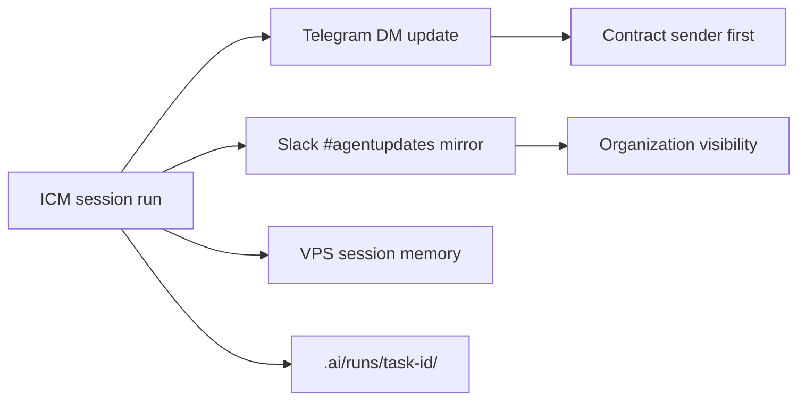

# Telegram session protocol — ICM + OpenClaw fleet coherence

**Contract:** `20260722-openclaw-dashboard-dezocode`  
**Template agent:** Alfred (`ctr-code-alfred1`)  
**Behaviors:** `.ai/agents/alfred/runtimes/openclaw/telegram/BEHAVIORS.md`

Every OpenClaw agent in the Alfred fleet — Alfred, subagents, dashboard-created agents —
follows **this protocol** for Telegram + Slack pairing.

---

## Coherence principle



**One truth, two channels:** Telegram message and Slack post share the same `task-id`,
`EVENT_TYPE`, and Result — Telegram may be slightly more conversational; Slack stays formal template.

---

## Contract sender reporting (mandatory)

**Contract sender:** dezocode (`U0BHYH0NMCY`) — person who issued this contract.

| Session event | Telegram to sender | Slack mirror |
|---|---|---|
| Session open | INTAKE summary | `[SAI][INTAKE][task-id]` |
| Plan posted | PLAN summary | `[SAI][PLAN][task-id]` |
| Material edit | CHANGE checkpoint | `[SAI][CHANGE][task-id]` |
| Verify complete | VERIFY result | `[SAI][VERIFY][task-id]` |
| Session end | HANDOFF summary | `[SAI][HANDOFF][task-id]` |
| Blocked | BLOCKED + **Telegram MCQ (2–4 complete plans)** | `[SAI][BLOCKED][task-id]` |

**BLOCKED rule:** Never Slack-only. Persist `continuation_checkpoint` → MCQ contract sender → resume on selection. See [BLOCKED-MCQ-CONTINUATION.md](../../.ai/agents/alfred/runtimes/openclaw/telegram/BLOCKED-MCQ-CONTINUATION.md).

**Latency:** Telegram to contract sender within **60s** of stage transition; Slack within **60s** after Telegram (or queued via `agent-report`).

---

## Session memory (Telegram as live thread)

Each agent maintains VPS session state per Telegram `chat_id`:

- See [session-memory.md](../../.ai/agents/alfred/runtimes/openclaw/telegram/session-memory.md)
- Service: `services/telegram-session/`

User replies in Telegram continue the **same** ICM run until HANDOFF or explicit `/new-task`.

Commands (all fleet agents):

| Command | Action |
|---|---|
| `/status` | Active task-id, stage, branch, last verify |
| `/memory` | Redacted context summary |
| `/new-task` | Close current run with HANDOFF; prompt for new purpose |
| `/help` | Link to agent intro + Telegram DM registry row |

---

## Fleet membership

| Agent | agent_id | Telegram behaviors path |
|---|---|---|
| Alfred | `ctr-code-alfred1` | `.ai/agents/alfred/runtimes/openclaw/telegram/BEHAVIORS.md` |
| config-expert | `config-expert` | `.openclaw/agents/config-expert/telegram/BEHAVIORS.md` (Alfred generates) |
| research-coordinator | `research-coordinator` | `.openclaw/agents/research-coordinator/telegram/BEHAVIORS.md` |
| User-created | `<user-slug>` | Dashboard wizard → Alfred provisions from template |

---

## Fleet coherence proof gate

Before org onboarding, **every** fleet agent must pass:

```bash
openclaw-dashboard/tests/smoke/fleet-coherence-gate.sh
```

Checks:

1. Agent has Telegram behaviors doc (or inherits Alfred template reference)
2. Row in `agent-telegram-registry.md` with valid links or BLOCKED
3. `hooks.json` or OpenClaw config lists `telegram_session: true`
4. Session memory path documented
5. Sample INTAKE Telegram + Slack pair evidenced in `.ai/runs/<task-id>/`

See [fleet-coherence-gate.md](./fleet-coherence-gate.md).

---

## Integration with three-connection gate

Telegram session protocol **extends** (does not replace) [subagent-onboarding-protocol.md](./subagent-onboarding-protocol.md):

1. Dedicated inbox (gate 1)
2. Slack intro with DM link (gate 2)
3. Habbo presence (gate 3)
4. **+ Session reporting** to contract sender on every run (this protocol)
5. **+ Fleet coherence** proof gate

Verification stack:

```bash
openclaw-dashboard/scripts/verify-agent-telegram.sh --scope registry
openclaw-dashboard/tests/smoke/fleet-coherence-gate.sh
openclaw-dashboard/tests/smoke/telegram-session-reporting.sh
```
