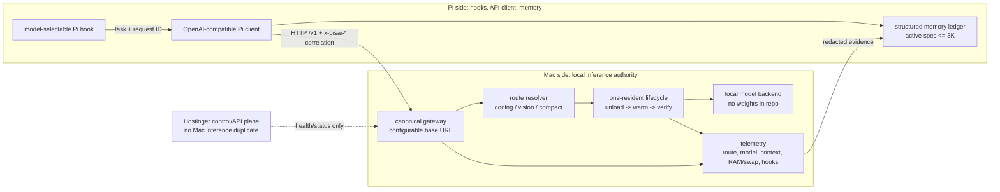

# Mac ↔ PiS AI prototype boundary

This is an informational prototype topology. The arrows identify ownership;
they do not grant production deployment or merge authority.

## Endpoint ownership

| Endpoint | Owner | Purpose |
|---|---|---|
| `POST /v1/chat/completions` | Mac gateway | Route and forward Pi inference |
| `GET /proxy/health` | Mac gateway | Liveness |
| `GET /proxy/runtime` | Mac gateway | Resident model/context/resource proof |
| `POST /v1/chat/completions` with `x-pisai-task=compact` | Mac gateway + Pi memory | Bounded hierarchical compaction |
| Pi-local `PiMemory` ledgers | Pi memory boundary | Structured todos/issues/hooks/decisions/evidence |

Hostinger may consume health/status or a separately authenticated control API;
it must not become a second Mac model-serving endpoint.

## Single-resident requirement

The existing Mac proxy is the lifecycle owner. Its request handler must hold a
FIFO async gate from route inspection through unload/warm/forward/stream
finalization. A lock released immediately after warm-up is insufficient: the
next request could unload the model while the previous response is streaming.
The proxy records `single_resident_queue_enter`,
`single_resident_queue_acquired`, and `single_resident_queue_released` events
in the same telemetry stream. The Pi adapter does not start a backend or bind a
second port.

## Acceptance evidence

- route decision and hook name share `request_id`;
- selected and resident model are both recorded;
- context is explicitly verified as 32,768 tokens;
- RAM/swap snapshot is recorded and unsafe transitions fail closed;
- vision requests require image content and the configured vision route;
- compact output is rejected above the 3,000-token active-spec budget;
- no secret, model weight, raw transcript, or credential is committed.
