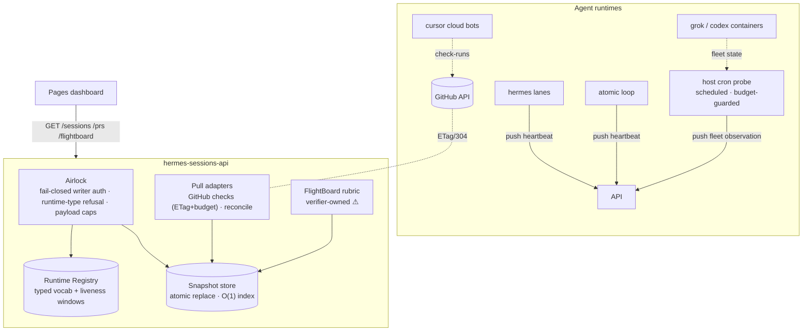

# Agent Runtime Registry & Sessions-API Hardening — Technical Design Document / RFC

| Document Metadata      | Details                                                        |
| ---------------------- | -------------------------------------------------------------- |
| Author(s)              | Ox Alpha                                                       |
| Status                 | Draft (WIP)                                                    |
| Team / Owner           | Sai landing automation (srv1840454)                            |
| Created / Last Updated | 2026-08-24                                                     |
| Scope                  | `/root/hermes-sessions-api/app.py` (+ new modules), container `hermes-sessions-api`, renderer contract compatibility |

## 1. Executive Summary

The sessions API that feeds the live PR-session dashboard grew around a single runtime — Hermes — and it shows: runtimes are free-form strings, Saul-class agents are detected by substring hacks, writes are open to the LAN when a token is unset, every write stalls all readers behind an fsync, and GitHub is polled without caching. Meanwhile the fleet is now multi-runtime by fact: hermes lanes, ox-alpha Atomic loops, Cursor cloud reviewers, grok/codex containers.

This RFC introduces a **Runtime Registry** — a closed, explicitly-registered set of agent runtime types with per-runtime liveness windows and capabilities — plus three doors: `report_heartbeat` (push), `reconcile_runtime_sources` (pull adapters over GitHub checks + local fleet), and `publish_flightboard_verdict` ⚠ (the verifier-owned door that alone may move Merge Readiness). Writes become fail-closed authenticated; the store gains snapshot reads and an O(1) index. The dashboard contract (`sai-sessions-v2`) evolves additively only.

## 2. Context and Motivation

### 2.1 Current State

Single-file stdlib service (`app.py`, 1049 lines) in container `hermes-sessions-api` on `127.0.0.1:8091`, fronted by tunnel → public `https://srv1840454.hstgr.cloud/api/hermes-sessions/*`. Store = one JSON document rewritten atomically (`tmp` + `os.replace`). The Pages dashboard (`scripts/render-sai-feature-maps`) consumes `/sessions`, `/prs`, `/flightboard/{pr}` client-side and displays flight bars only from **verifier-gated** values bound to the full current HEAD.

```text
app.py  (everything lives here today)
├── Handler          HTTP airlock + routing + auth + CORS
├── load()/save()    whole-store JSON, fsync, under global LOCK
├── normalize_session        free-form agent/harness/model strings
├── liveness/enrich          heartbeat fresh/stale/missing (honest None)
├── flightboard_for_pr       verifier-owned 45/20/20/10/5 rubric, P2 cap 85
├── attach_ci_blocks         GitHub check-run fetch per PR card (no cache)
└── group_by_pr              linear scan → PR cards
```

**Leaking doors (today):**

- `_auth_write()` returns True when `SESSIONS_WRITE_TOKEN` is unset — an unauthenticated write door on a publicly-tunneled host, gated only by an env var that happens to be set right now.
- Runtimes are *strings, not types*: `normalize_session` accepts any `agent`/`harness`; nothing distinguishes an `atomic` loop from a `cursor` bot from a typo.
- Saul identity is a substring: `agent == "saul" or "saul" in harness.lower()` (`attach_ci_blocks`) — `"saul-runner"` or `"notsaul"` both match. The same pattern will be copied for every future privileged agent.
- One heartbeat freshness constant for all runtimes, though an Atomic cycle heartbeats every ~15 min while Hermes lanes beat every ~2 min — one of them is always lying.
- Every write does `load → mutate → save(fsync) → replace` under the global `LOCK`; a slow disk stalls all readers including the dashboard's poll path.
- `attach_ci_blocks` fetches GitHub check-runs per PR card per request with no ETag reuse, against a rate budget that has already been observed exhausted (`rate_limited_now`).

### 2.2 The Problem

Open-PR session cards under-represent the fleet: Cursor cloud reviewers (which report via GitHub checks, e.g. `Cursor Security Agent`, `Cursor Bugbot`) and grok/codex containers have no sessions presence, so cards show `Agent: NONE` or Hermes-only state while four other runtime families are actively working the PR. The PR76→PR136 handover made this visible: review continuity survived, but runtime attribution did not. Operationally, one bad deploy of the API (open writes) or one GitHub rate-limit storm degrades the owner's single source of landing truth.

## 3. Goals and Non-Goals

### 3.1 Functional Goals

- [ ] A closed **Runtime Registry**: every session's runtime is a registered type; unregistered runtimes are refused at the door, not stored as mystery strings.
- [ ] Non-Hermes runtimes appear on open-PR cards with correct attribution, via pull adapters (GitHub checks → Cursor family; local fleet → tmux-grok/docker inventory pushed by host cron).
- [ ] Per-runtime liveness windows (fresh/stale thresholds are properties of the runtime, not globals).
- [ ] Writes fail-closed: no token configured ⇒ reads serve, writes refuse.
- [ ] Performance: readers never block on writers; GitHub polling respects ETags and a rate budget; PR-card assembly is cached and O(1)-indexed.
- [ ] **REQUIRED — determinism:** flight-board state is a pure function of published verdicts + CI/goals evidence. Agents have ZERO flight-deck management surface; identical evidence always produces an identical board.
- [ ] **REQUIRED — bounded CPU:** no expensive processes feed API data. Idle API ≈ 0% CPU; every feeding process (adapters, fleet probe) is scheduled, budget-guarded, and completes in bounded time. Busy-polling loops are forbidden.

### 3.2 Non-Goals (Out of Scope)

- [ ] No migration off the JSON store to a database (atomic `os.replace` snapshots are sufficient at this scale).
- [ ] No breaking change to `sai-sessions-v2`: additive optional fields only; a breaking evolution would be a v3 with dual-read (separate decision).
- [ ] No multi-repo support (`Dezocode/Sai` remains the implicit repo; parameterizing it is deferred).
- [ ] We will NOT add agent-managed flight-deck upkeep (agents never maintain their own readiness telemetry).
- [ ] No auto-registration of unknown runtimes — novelty is refused until a human registers it (intent: the registry is a curated vocabulary, not a log).
- [ ] PR136 merge repair itself (dirty mergeable state vs advanced main) is handled by the landing loop, not this API.

## 4. Proposed Solution (High-Level Design)

### 4.1 System Architecture Diagram



The **airlock** is the HTTP handler edge: writer authentication, runtime-type membership, payload caps, and idempotency all resolve there; everything behind it trusts the registry and the store invariants.

### 4.2 Architectural Pattern

Registry pattern (closed vocabulary + capability records) over a snapshot-persisted document store, with pull-adapters normalizing external evidence into the same typed session shape that push clients produce. One ingestion shape, two transports.

### 4.3 Key Components

| Component | Responsibility | Stack | Justification |
| --------- | -------------- | ----- | ------------- |
| Runtime Registry | Closed set of runtime types; liveness window; capabilities (`reports_head`, `can_push`, `authoritative_for_checks`) | stdlib dataclass + JSON section in store | Makes "unknown runtime" unrepresentable; per-type honesty instead of globals |
| Snapshot Store | Whole-store atomic persist (`tmp+replace`), immutable reader snapshots, `{id→session}` and `{pr→[ids]}` indexes | stdlib | Readers never block; O(1) lookups replace linear scans |
| GitHub Checks Adapter | Synthesizes/maintains sessions for check-run-borne agents (Cursor family) bound to exact head. **DECIDED:** check-run `in_progress` ⇒ session `status=running` (a live check IS a working agent). Passes are SCHEDULED + budget-guarded — never busy-polling | existing `_gh_get` + ETag cache + rate-budget guard | Cursor bots cannot push; their authoritative evidence already lives in check-runs |
| Fleet Probe (host cron) | Pushes container/tmux-grok inventory observations via authenticated heartbeat | bash + existing cron pattern | Docker socket stays out of the API container |
| FlightBoard Verdict Door | Existing verifier-owned rubric, formally named and capability-checked | existing logic | Already correct (P2 cap 85, genuine-exact-head requirement); needs typing, not redesign |

| Path | Action | Owns |
| ---- | ------ | ---- |
| `app.py` | change | Doors, routing, auth refusal; delegates internals |
| `runtime_registry.py` | add | `RuntimeType`, registry CRUD, per-type liveness/capabilities |
| `storage.py` | add | Snapshot persistence, indexes, no-fsync-in-lock policy |
| `adapters/gh_checks.py` | add | Check-run → session synthesis, ETag + budget |
| `test_app.py` | change | Door-level RGR slices + property tests |
| `deploy` (container restart) | config | Rollout; token env mandatory |

### 4.4 The Door Set at a Glance (Stranger-Across-Time View)

`register_runtime` · `report_heartbeat` · `reconcile_runtime_sources` · `publish_flightboard_verdict` ⚠ · `retire_session` (30-day retention) · `pr_card` · `list_sessions`

Reading these alone: you can register what kinds of agents exist; agents announce life; the server goes looking for agents that can't speak; exactly one door turns verified evidence into the merge-readiness number; sessions can be retired (never silently deleted); and the outside world can read who is working on what. Only the verdict door carries irreversible weight — it is what a human's merge click will trust.

## 5. Detailed Design

### 5.1 The Doors (Entrypoint Contracts)

```python
# — Vocabulary. You cannot BE a runtime until a human says you exist. —

register_runtime(
  rt: RuntimeType,                      # newtype: validated slug, e.g. "atomic", "cursor"
  window: LivenessWindow,               # fresh_seconds; stale is derived, never independent
  capabilities: RuntimeCaps,            # reports_head: bool, source_of: frozenset[EvidenceKind]
): Result[RegisteredRuntime, RegistryError]
// Guarantee: defines how every session of this runtime is judged and what it may attest.
// RegistryError = DuplicateRuntime | InvalidSlug | BadWindow
// Refusal: sessions referencing an unregistered RuntimeType cannot be constructed —
// the session model holds a RegisteredRuntime, not a string.

# — Life. Any registered runtime announces its own state; idempotent per session. —

report_heartbeat(
  token: WriterToken,                   # minted nowhere in this API; provisioned out-of-band
  obs: Observation,                     # {session_ref, status?, head_sha?, model?, note?}
): Result<SessionView, HeartbeatError>
// Guarantee: the named session reflects this observation exactly once, with a server-stamped heartbeat.
// Acceptance is two-tier:
//   TIER 1 (primary): runtime already registered -> session reflects observation exactly once.
//   TIER 2 (fallback, SAUL_REGISTRY_AUTOREGISTER!=0): unknown runtime -> auto-registered PROVISIONAL
//          (conservative window, minimal caps), session accepted, view flagged registration:"provisional".
//          An operator later promotes it to full RegisteredRuntime — or retires it.
// HeartbeatError = Unauthorized | RuntimeAutoregisterDisabled | PayloadTooLarge | MalformedObservation
// Refusals: observations containing flightboard-shaped keys are stripped at this door — agents can
// never touch merge truth (it flows only through publish_flightboard_verdict ⚠). Also:
// head_sha shorter than 40 chars is dropped (kept optional); status outside KNOWN_STATUSES is
// stored but flagged status_recognized=False (existing honesty rule preserved).

# — Search. The server looks for agents that cannot speak for themselves. —

reconcile_runtime_sources(
  token: WriterToken,
  sources: frozenset[SourceKind],       # github_checks | local_fleet   (closed sum type)
): Result<ReconciliationReport, ReconcileError>
// Guarantee: every agent evidenced by the chosen sources exists as a session bound to its exact head,
// and none was invented. Idempotent: reconciling twice changes nothing.
// ReconcileError = Unauthorized | SourceUnavailable | RateBudgetExhausted
// Refusals: synthesized sessions carry runtime=cursor (etc.) and origin="pull:<source>"; they are
// indistinguishable in shape from pushed sessions — because they are equally real.

# — Verdict. The ONLY door that moves Merge Readiness. —

publish_flightboard_verdict(
  token: VerifierToken,                 # DECIDED: separate secret from WriterToken
                                        # fixer agents hold writer rights w/o merge-truth rights
  verdict: FlightVerdict,               # {pr, requirements, ci, preservation, saul{genuine_exact_head,p0,p1,p2}, hygiene}
): Result<FlightBoard, VerdictError>
// Guarantee: the published readiness for this PR equals the rubric applied to this verdict, P2-capped,
// and DETERMINISTIC — identical verdicts yield identical boards; agent input cannot perturb it.
// bound to the stated head — until the next legitimate verdict replaces it.
// VerdictError = Unauthorized | MalformedEvidence (=> component reads "unavailable", never invented)
```

**Per-door audit (rubric results):**

| Door | (1) Joint | (2) One sentence | (3) Honest | (5) Every exit | (6) Refusals real | (7) Trust transition | (8) Chokepoint |
| ---- | --------- | ---------------- | ---------- | -------------- | ----------------- | -------------------- | -------------- |
| `register_runtime` | ✅ defines a species | ✅ | ✅ | dup → `DuplicateRuntime`; bad slug refused | unknown runtime unconstructable | human ⇒ registry (admin token) | vocabulary, yes |
| `report_heartbeat` | ✅ "announce life" | ✅ one reflection per observation | ✅ creation AND provisional-fallback are both documented | replay → same view; oversized → `PayloadTooLarge`; dead token → `Unauthorized`; autoregister off → `RuntimeAutoregisterDisabled` | full membership requires either prior registration or explicit opt-in fallback | n/a (already-tokened) | session-state writes funnel here (PATCH merges deprecated → thin alias) |
| `reconcile_runtime_sources` | ✅ "go find workers" | ✅ existence + binding, nothing more | ✅ "reconcile" promises idempotence | rate budget → named error; GH down → `SourceUnavailable`, store untouched | cannot invent agents without source evidence | external evidence ⇒ session (server-stamped `origin=pull:`) | sole path for check-run-borne agents |
| `publish_flightboard_verdict` ⚠ | ✅ "render the merge verdict" | ✅ rubric-or-unavailable, never invented | ✅ irreversibility-by-consequence documented | malformed ⇒ component unavailable; replay ⇒ same board | readiness without genuine exact-head Saul evidence is unrepresentable (P2-cap + genuine flag in type) | verifier token ⇒ published truth | ✅ THE merge-truth door |
| `retire_session` | ✅ "end of duty" | ✅ retired records retained 30 days then pruned (DECIDED) | ✅ retire ≠ delete | double-retire idempotent | no deletion door before horizon | n/a | 30-day prune is the only GC |
| `pr_card` / `list_sessions` | ✅ read joints | ✅ read-only views | ✅ | store read is snapshot-consistent | cannot mutate | n/a | n/a |

### 5.2 API Interfaces — The Same Doors on the Wire

```
# Token classes (DECIDED): VERIFIER_TOKEN guards flightboard ⚠ + registry; WRITER_TOKEN guards heartbeats/reconcile.
# Registry (admin capability = VERIFIER_TOKEN class; registry edits are rare and deliberate)
POST   /api/runtime-registry                       201 Created   # = register_runtime
GET    /api/runtime-registry                       200           # current vocabulary + windows + caps

# Life (writer token; heartbeat is idempotent — retry freely)
POST   /api/agent-sessions/heartbeat               200 OK        # = report_heartbeat
#   403 Unauthorized (bad/missing token)  ·  422 UnregisteredRuntime  ·  413 PayloadTooLarge
#   Alias kept: POST/PATCH /api/agent-sessions/sessions[...] → same door, legacy shape accepted

# Reconciliation (verifier token; safe to schedule every cycle)
POST   /api/agent-sessions/reconcile               200           # = reconcile_runtime_sources
#   202 Accepted if sources deferred under rate budget  ·  503 SourceUnavailable

# Verdict (verifier token — THE merge-truth door)
POST   /api/agent-sessions/flightboard/{pr}        200 OK        # = publish_flightboard_verdict ⚠
#   403 Unauthorized  ·  422 MalformedEvidence (components degrade to unavailable, board still served)

# Reads (public, unchanged names, additive fields only)
GET    /api/agent-sessions/sessions                200           # ?pr= ?runtime= filters added
GET    /api/agent-sessions/prs                     200           # cards incl. per-runtime agent lists
GET    /api/agent-sessions/by-pr/{pr}              200
GET    /api/agent-sessions/health                  200
```

No `200 OK` wrapping errors: failures are `4xx` with `{"error": "<Named>"}`. GET stays safe; the three mutating verbs are exactly the three mutating doors.

### 5.3 Data Model / Schema

Store top level (still one atomically-replaced JSON document):

```jsonc
{
  "schema": "sai-sessions-v2",            // unchanged; all changes additive-optional
  "updated_at": "...",
  "runtimes": {                           // NEW — the registry IS data, versioned with the store
    // each entry: {"fresh_s":N,"caps":{...},"status":"registered|provisional","first_seen_at":...}
    "hermes":  {"fresh_s": 900,  "caps": {"reports_head": true,  "can_push": true}},
    "atomic":  {"fresh_s": 3600, "caps": {"reports_head": true,  "can_push": true}},
    "cursor":  {"fresh_s": 7200, "caps": {"reports_head": true,  "can_push": false, "source_of": ["ci"]}},
    "grok":    {"fresh_s": 1800, "caps": {"reports_head": false, "can_push": false}},
    "codex":   {"fresh_s": 1800, "caps": {"reports_head": true,  "can_push": false}},
    "human":   {"fresh_s": 86400,"caps": {}}
  },
  "sessions": { "<id>": { "runtime": "atomic", "...": "existing v2 fields", "origin": "push|pull:github_checks|pull:fleet" } },
  "flightboard": { "<pr>": { "..." : "existing verifier verdicts" } },
  "idempotency": { }
}
```

- `sessions[].runtime` is the typed joint; legacy rows migrate once (`agent`-inference table applied at startup, recorded in `migrated_at` — never re-guessed).
- `origin` is a provenance sum-value written only by the door that created the row; it is display/triage metadata, not authority (authority stays in tokens).
- Sum-typed `status` recognition list stays; unrecognized statuses remain visible-but-flagged (existing honesty rule).

### 5.4 Algorithms and State Management

```text
on(report_heartbeat)
  require WriterToken                       # fail-closed: unset config ⇒ refuse ALL writes
  rt = registry.lookup(obs.runtime)         # unregistered ⇒ 422, nothing stored
  sid = stable_id(obs)                      # pr-scoped, deterministic
  sess = store.index[sid] or new Session(runtime=rt, origin=push)
  apply obs onto sess (None-fields never clobber)
  stamp server heartbeat_at = now
  persist snapshot (atomic replace, no fsync under lock)
  return SessionView(sess)                  # identical view on replay
```

```text
on(reconcile_runtime_sources)
  if rate_budget.exhausted: return RateBudgetExhausted
  if github_checks in sources:
    for each open PR card:
      runs = gh.check_runs(head, etag=cache[head])     # 304 ⇒ reuse cached synthesis
      for run in runs where name matches a registered check-borne runtime:
        upsert session(runtime, head=run.head, status=map(run.conclusion), origin=pull:github_checks)
  if local_fleet in sources:            # fed by host cron push, not by container introspection
    apply queued fleet observations through report_heartbeat semantics
  # deterministic: sources and PR keys iterated in sorted order — same inputs, same board
  return report(created, updated, skipped)
```

- **Concurrency:** single global write lock survives (writes are rare); reads take the last committed snapshot with no lock — atomicity comes from `os.replace`. `fsync` moves out of the locked section (durability window ≤ one flush interval is acceptable for telemetry; the signed Saul evidence chain does NOT depend on this store).
- **Idempotency:** `report_heartbeat` keyed by `(token-class, session_ref)`; `reconcile` by construction; `publish_flightboard_verdict` keeps its existing last-write-wins with `computed_at`.
- **Rate budget:** `_observe_rate_headers` already sees `X-RateLimit-*`; budget guard blocks adapter passes when remaining < reserve, surfaces `RateBudgetExhausted`, and schedules retry — the dashboard degrades to cached cards, never lies.

### 5.5 Agent-facing README — what happens when the API stops you

This section ships verbatim as `AGENTS.md` next to `app.py` at implementation, and is reproduced here so the spec documents the boundary from the agent's chair. Behavior below was **probed against the running API**, not assumed.

**Observed today (live probes):** every rejected write returns the same `401 {"error":"unauthorized"}` — bad token, missing token, malformed JSON, oversized payload are indistinguishable, and runtime-type problems aren't even evaluated (auth runs first). You cannot self-diagnose. The registry changes that: each stop reason becomes a distinct, fixable response.

**Post-implementation refusal contract:**

| You sent | You get | What it means | Your fix |
| -------- | ------- | ------------- | -------- |
| Valid heartbeat, registered runtime | `200` + server-stamped view | accepted; retry of the same observation is safe | none |
| No / wrong `X-Sessions-Token` or Bearer | `401 {"error":"unauthorized"}` | you are not provisioned | get the writer token from the operator; do NOT retry-loop |
| Server restarted without token configured | `503 {"error":"writes_disabled_failclosed"}` | operator misconfiguration; reads still work | page the operator; writes are down repo-wide, not just for you |
| `runtime` not registered | `200 provisional` (autoregister on) or `422 {"error":"RUNTIME_AUTOREGISTER_DISABLED"}` (off) | fallback tier: you get tracked immediately but flagged `registration:"provisional"` until an operator promotes your species | keep heartbeating; ping operator for promotion — or they'll notice you on the board |
| Body > 256 KB | `413 {"error":"PAYLOAD_TOO_LARGE"}` | observations are small by contract | trim note fields; evidence lives in Saul/GitHub, not here |
| Malformed JSON | `400 {"error":"MALFORMED_JSON"}` | transport bug in your client | fix serializer; do not retry unchanged |
| Reconcile while GitHub budget reserved | `429 {"error":"RATE_BUDGET_EXHAUSTED"}` or `202 deferred` | server is protecting the shared rate limit | nothing; next scheduled pass picks it up |
| Reads (`GET /*`) | always public | telemetry reads need no token | n/a |

**Retry policy:** `200` ⇒ never resend. `401`/`422`/`413`/`400` ⇒ never resend unchanged (the input is wrong; looping hides a real defect). `429`/`202` ⇒ back off and retry next cycle. `503` ⇒ wait for operator.

**Registration path:** if your runtime keeps getting `422 UNREGISTERED_RUNTIME`, that is the system telling you your species needs declaring first — one authenticated `POST /api/runtime-registry` with your liveness window and capabilities, then resume. This refusal is deliberate: an untyped agent on the flight board is a lie every downstream reader would inherit.

## 6. Alternatives Considered

| Option | Pros | Cons | Reason |
| ------ | ---- | ---- | ------ |
| A: Keep stringly `agent`/`harness`, harden ad-hoc | Zero schema motion | Every privileged-agent check becomes a new substring hack; unknown runtimes silently stored; per-runtime windows impossible | Fails "refusals are real"; the Saul-substring bug would recur per agent |
| B: Pull-only authority (no push door) | Single writer = max consistency | Loses push freshness; self-declared fields die; every runtime needs server-side knowledge | Discards the working hermes/atomic heartbeat path |
| C: Push-only SDK | Simplest server | Cursor-style hosted bots never appear; coverage gap is the original complaint | — |
| D: **Hybrid registry + pull adapters + push (Selected)** | Full fleet coverage; typed refusals; push freshness preserved; adapters normalize external evidence into the SAME shape | Two transports to document | **Selected:** the two real joints — agents announcing life, and the server discovering silent workers — get one door each |
| E: SQLite store | Real queries, WAL concurrency | New dependency + migration for a 5-PR dataset | Premature; snapshot store + indexes meet measured need |

## 7. Cross-Cutting Concerns

- **Trust transitions, enumerated:** (a) network caller ⇒ writer, only via token check in `_auth_write`, now fail-closed; (b) external evidence ⇒ session row, only inside `reconcile_runtime_sources`/`report_heartbeat`; (c) verifier token ⇒ published merge truth, only via `publish_flightboard_verdict` ⚠. No other door raises authority. (Rubric #7.)
- **Irreversible/consequential effects funneled:** merge-truth via the verdict door ⚠; store mutation via the single persist point in `storage.py`. Session retirement is a status change, deliberately NOT destructive. (Rubric #8.)
- **Secrets:** the API never handles repo credentials (`_gh_get` is public-data-only — preserved); worker scripts keep tokens in env; rendered Pages artifact must remain free of credential material (regression-scanned).
- **Provisional ceiling:** fallback-registered runtimes get conservative windows, minimal caps, `registration:"provisional"` on every view, and are excluded from any authoritative role until promoted — being visible is not being trusted.
- **Threat model:** hostile LAN peer forging heartbeats ⇒ mitigated by mandatory token + payload caps + provisional ceiling; GitHub rate-limit exhaustion ⇒ budget guard + ETag; malicious finding text ⇒ redaction pipeline unchanged; compromised verifier token ⇒ rotate (it can move readiness — treat like a deploy key).
- **Availability:** reads never block on writes; GH outage degrades CI enrichment to cached/absent with honest sourcing, exactly as today.

## 8. Test Plan

RGR slices through public doors (each: one failing behavior test → smallest green → refactor):

1. **Runtime refusal:** POST heartbeat with `runtime: "notarealthing"` → `422 UNREGISTERED_RUNTIME`, store unchanged; then `register_runtime("notarealthing")` → same POST succeeds. (Door: registry closed-world.)
2. **Fail-closed auth:** restart with `SESSIONS_WRITE_TOKEN=""` → any write ⇒ `403/503` refusal, reads still 200; restore token → writes pass. (Rubric #5 exit: misconfigured deploy.)
3. **Heartbeat idempotency:** same observation twice (incl. replay after restart) ⇒ identical `SessionView`, single store revision delta.
4. **Cursor synthesis:** fixture check-run payload (`Cursor Security Agent`, head=H, in_progress) → `reconcile_runtime_sources(github_checks)` ⇒ session `runtime=cursor`, `head=H(40)`, `status=running`, `origin=pull:github_checks`; second reconcile ⇒ no duplicates. Short-SHA / missing-head runs refused (exact-head rule).
5. **Fleet push path:** host-cron style observation (tmux-grok inventory) ⇒ session `runtime=grok`, `origin=push:fleet`; unknown runtime variant refused.
6. **Readers never block / never tear:** property test — N reader threads poll `/prs` continuously while M writers hammer heartbeats; every response is either the old or new complete snapshot (never partial, never error), and total stall < bound.
7. **Rate budget:** simulate `X-RateLimit-Remaining: 0` ⇒ reconcile returns `RateBudgetExhausted` without any GH call; ETag match ⇒ zero-body 304 path reused.
8. **Verdict caps:** Saul `{genuine_exact_head:true, p2:4}` ⇒ readiness capped at 85 (regression-proof for auditor check #4); non-genuine or P1>0 ⇒ Saul component 0 + cap 60; malformed evidence ⇒ component `unavailable`, board still serves with `source:"unavailable"`.
9. **Fallback auto-registration:** autoregister ON → first heartbeat from unknown runtime succeeds, view flagged `registration:"provisional"`, registry shows provisional entry; operator promotes → flags clear; autoregister OFF → same heartbeat returns `RuntimeAutoregisterDisabled`.
10. **Migration:** legacy row without `runtime` ⇒ startup inference assigns registered type from `agent`/`harness`, stamps `migrated_at`, never guesses twice.

**Interactive verification (owner-runnable):**

```bash
curl -s localhost:8091/api/agent-sessions/health | jq '.service'                    # expect "hermes-sessions"
curl -s -X POST localhost:8091/api/agent-sessions/heartbeat \
  -H "X-Sessions-Token: $TOK" -H 'Content-Type: application/json' \
  -d '{"runtime":"atomic","pr":136,"status":"working","head":"<40-char sha>"}'      # expect 200 + server heartbeat_at
curl -s -X POST localhost:8091/api/agent-sessions/heartbeat -H 'Content-Type: application/json' \
  -d '{"runtime":"ghost","pr":136}'                                                  # expect 422 UNREGISTERED_RUNTIME
curl -s "localhost:8091/api/agent-sessions/prs" | jq '.[] | select(.pr==136)'       # card lists runtime-tagged agents
# Pages check: open pr-sessions.html — PR136 card shows the runtime-tagged agent set; no fabricated readiness.
# Stop-probes (each expects the exact refusal from the README table):
curl -s -X POST localhost:8091/api/agent-sessions/heartbeat -H 'Content-Type: application/json' \
  -d '{"runtime":"atomic","pr":136}' | grep -o unauthorized          # expect 401 unauthorized
unset TOK; curl -s -X POST localhost:8091/api/agent-sessions/heartbeat -H 'Content-Type: application/json' \
  -d '{"runtime":"atomic"}' -w '\n%{http_code}\n'                    # expect 401 now; 503 after fail-closed rollout w/o token
```
(With `SESSIONS_WRITE_TOKEN` deliberately unset in a staging container, writes must refuse fail-closed rather than succeed — that single check proves the open-door default is gone.)```

## 9. Decisions Log & Remaining Minor Questions

Resolved with owner:
- [x] Enrollment model: **hybrid** (pull adapters + authenticated push).
- [x] Write auth: **fail-closed mandatory**.
- [x] Perf scope: **full pass** + CPU contract REQUIRED above.
- [x] Cursor lifecycle: `in_progress` ⇒ `running`.
- [x] Verdict secret split from writer secret.
- [x] Retired-session retention: 30-day prune.
- [x] Findings stay out of this API.
- [x] Fleet probe: host cron pushes; no docker socket in container.
- [x] **Determinism REQUIRED:** flight-board computed only from verifier verdicts + CI/goals evidence; agents hold no management surface over it.
- [x] **No expensive feed processes REQUIRED:** all ingestion is push-door or scheduled budget-guarded passes.
- [x] Unknown-runtime handling: **two-tier** — primary operator registration; FALLBACK auto-provisional registration behind `SAUL_REGISTRY_AUTOREGISTER` (default on), conservative caps, flagged `provisional` until promoted.

Remaining minor (defaults chosen; override at implementation review):
- [ ] Fresh/stale seconds per runtime — initial: hermes 900s, atomic 3600s, cursor 7200s, grok/codex 1800s, human 86400s.
- [ ] `/spawns` endpoint joins typed model now vs later — default later.
- [ ] Rate-budget reserve floor — default halt below 200 remaining core requests.