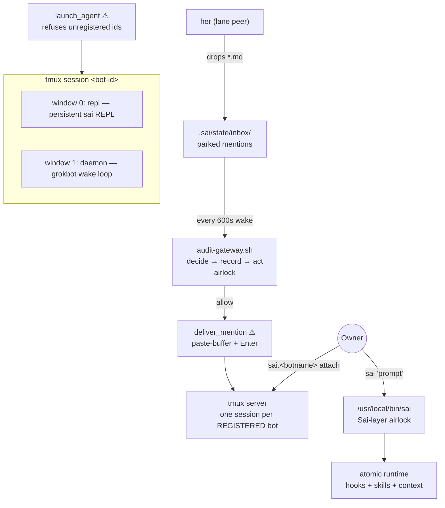

# Sai CLI Layer over Atomic — Per-Agent tmux Channels, Hooks & Config — Technical Design Document / RFC

| Document Metadata      | Details                                                                  |
| ---------------------- | ------------------------------------------------------------------------ |
| Author(s)              | Ox Alpha                                                                 |
| Status                 | Draft (WIP) — decisions resolved with owner 2026-08-25 |
| Team / Owner           | Sai landing automation · grunt lane (sai-grunt-f36750)                    |
| Created / Last Updated | 2026-08-25                                                               |
| Scope                  | `prototypes/plugins/cross-intercom/**`, `/usr/local/bin/sai`, `/root/.bashrc`, host tmux |
| Lane                   | Dezocode/Sai **#141** (branch `specs/agent-runtime-registry`)            |

## 1. Executive Summary

The Sai Harness already derives its hook model from Atomic CLI, and GOALS.md names Atomic integration as a next-round goal. Today that integration is invisible and unwatchable: the grokbot daemon drains inbox mentions into *headless* `atomic` processes nobody can observe, there is no `sai` command on PATH, and the only tmux presence is a dead pane. An owner who wants to see what their fleet is doing must hunt PIDs and log files.

This RFC adds the **Sai layer over Atomic** as a PR #141 goal: a thin, honest layer that presents Atomic as the **`sai` CLI**, gives every registered bot exactly **one named tmux session** as its live channel, delivers inbox mentions **into that channel** through the existing audited gateway, and lets the owner attach with a two-keystroke alias (`sai.<botname>`). Three doors carry the design: `launch_agent` ⚠ (the only way a bot's channel comes to exist — registration-gated), `deliver_mention` ⚠ (the only way a parked mention reaches a bot — gateway-audited, exactly-once), and the `sai` CLI itself (one airlock turning a human/bot prompt into a hooked Atomic turn).

## 0. Resolved Decisions (owner, 2026-08-25)

1. **Delivery mechanics:** paste-into-REPL — combined mentions become ONE submitted turn in window 0; `.sent` markers follow the paste.
2. **Channel birth:** auto-create on drain — a wake that finds mentions and no live channel runs `launch_agent`, then delivers. Mentions never wait for a human.
3. **Scope:** BOTH registered bots (`sai-grunt` AND `her`) get channels + aliases in this round.
4. **Compatibility:** BREAKING OK (prototype tier)
5. **Monitoring surface (owner, 2026-08-25):** every agent's atomic computer is its own root-level tmux session; `sai.<botname>` attaches for live observation; a gated `channel-probe` writes `state/channels.json` every wake so the sessions-API fleet probe can watch all channels directly. — headless-first inbox consumption is retired; `spawn_tracked` survives only as the named CI-debugger fallback.

### Backwards Compatibility

- The plugin lane has exactly two downstream consumers — the sai-grunt and her runtimes plus their owner — all co-located and updatable in the same change. No external callers exist; nothing ships to production `.cursor/`.
- Retired behavior: headless-first inbox consumption via `spawn_tracked("inbox")`. Its replacement keeps every auditable property (gateway verdict-before-act, flock serialization, `.sent` exactly-once ledger) and adds observability. `spawn_tracked` remains ONLY for CI-red debugger launches (`debugger-launch` decision), where headless is correct.
- Unchanged contracts: `agents.yaml` OpenBot-visible fields untouched (`tmux:` keys follow the ignored-extension convention); gateway decision vocabulary unchanged (`inbox-drain` covers delivery); audit log format unchanged.

## 2. Context and Motivation

### 2.1 Current State

```text
host (root)
├── /root/.bashrc                     ← no sai entries
├── /usr/bin/atomic                   ← real runtime, generic coding-agent defaults
├── (no /usr/local/bin/sai)           ← sai layer does not exist yet
├── tmux server
│   ├── atomic-live-swarm             ← unrelated hub
│   └── grokbot-f36750                ← DEAD pane (signal 15 @ 01:58Z) — orphaned channel
└── prototypes/plugins/cross-intercom/
    ├── .sai/hooks.json               ← 19-event wiring; tick/stop fire grokbot.sh
    ├── .sai/agents.yaml              ← REGISTRATION: her, sai-grunt (ids, pr_assignment, side, monitors)
    ├── .sai/state/inbox/*.md         ← parked mentions (composer park-and-drain semantics)
    ├── .sai/state/audit.jsonl        ← gateway decide→record→act trail
    └── .sai/hooks/grokbot.sh         ← daemon: cmd_inbox → spawn_tracked("inbox") → HEADLESS atomic
```

- **Architecture:** the daemon (`grokbot.sh`) wakes every 600 s, sweeps `state/inbox/*.md`, combines them into ONE follow-up turn, and launches `spawn_tracked inbox 0 "$combined"` — a detached, headless `atomic "$combined"` process with self-heal (stuck-kill/requeue/dead-letter). Verified end-to-end 2026-08-25 (shimmed drill: 2 mentions drained as one turn; gateway `inbox-drain allow/ok`; `.sent` markers correct).
- **Limitations:** the launched runtime is invisible and unreachable — no pane, no attach, no steering. Each drain mints a *fresh* session with no memory of prior turns. The one tmux session that existed (`grokbot-f36750`) died and nothing recreates it meaningfully.
- **Leaking doors (today):**
  - Mention intake has **two exits**: the daemon's headless `spawn_tracked` AND any human running `grokbot.sh inbox` by hand — both reach `atomic`, neither is *the* delivery door, and only the pair together guarantees at-most-once (flock + `.sent` markers).
  - Runtime identity is implicit: whatever `AGENT` resolves to at launch time becomes a bare process with no channel name, so `ps` output is the only attribution.
  - The `atomic` invocation carries zero Sai context: no crosscomm skill, no aspectizer guarantee beyond hooks.json discovery-by-cwd, no flightboard identity.

### 2.2 The Problem

Orders dropped by her or the owner land in the inbox and are executed by ghosts: work happens (or silently requeues), but no human can watch, steer, or attribute it. Conversely, the owner cannot summon a specific bot ("let me see grunt") — there is nothing to attach to. The OpenBot channel-per-agent architecture the harness claims in `agents.yaml` exists on paper only; channels are not real.

- **User impact:** the owner loses line-of-sight on fleet work mid-turn; steering requires killing and relaunching.
- **Business impact:** the tandem build-out contract (§10 of the crosscomm skill: her sends goal-targeting prompts → grunt fans out) depends on reliable, observable intake. Ghost execution makes "mentions first" unverifiable by eye.
- **Technical debt:** danger (spawning runtimes, spending model turns) sits in an unwatchable path while the watched path (tmux) is decorative.

## 3. Goals and Non-Goals

### 3.1 Functional Goals

- [ ] Every registered bot in `agents.yaml` has **exactly one** tmux session named after its id, running a persistent `sai` REPL — the bot's live channel.
- [ ] Parked inbox mentions are delivered **into** the target bot's channel as one combined turn, through the audited gateway, exactly once (existing flock + `.sent` semantics preserved).
- [ ] A `sai` CLI exists on PATH (`/usr/local/bin/sai`): Atomic with Sai-layer defaults baked in (crosscomm skill, hooks discovery anchored at the plugin checkout, session naming under the bot's project dir).
- [ ] Root's shell gets `sai.<botname>` aliases (auto-generated from `agents.yaml`) that attach-or-create the bot's channel.
- [ ] Registration is the vocabulary: `launch_agent` refuses unregistered bot ids — the tmux namespace can only contain registered agents.
- [ ] Headless self-heal (stuck-kill / requeue / dead-letter) continues to exist for CI-red debugger launches; interactive channels are supervised by liveness checks instead.

### 3.2 Non-Goals (Out of Scope)

- [ ] We will NOT touch production `.cursor/` wiring, verifier contracts, or Go code — prototype-tier containment (`prototypes/plugins/cross-intercom/**`) holds, matching the #141 lane rules.
- [ ] We will NOT change the sessions-API wire contract (runtime registry, heartbeats, flightboard) — this RFC consumes registration; it does not extend it.
- [ ] We will NOT give bots multi-window fleets, panes-of-panes, or shared sessions — one session, one bot, one REPL window plus one daemon window, fixed shape.
- [ ] We will NOT introduce a second intake plane (no socket servers, no HTTP listeners on the host). The inbox directory remains the only mention source.
- [ ] We will NOT auto-register unknown bot names found in tmux or bashrc — novelty is refused until `agents.yaml` gains the entry.

## 4. Proposed Solution (High-Level Design)

### 4.1 System Architecture Diagram



The **airlock is singular**: untrusted text becomes a bot's working order only inside `deliver_mention` (gateway-allowed) or the `sai` CLI (human-invoked). Everything behind those doors may trust its own invariants.

### 4.2 Architectural Pattern

Channel-per-agent (OpenBot-derived), realized as **tmux-as-transport**: the same joint (`deliver_mention`) that today targets a process boundary instead targets a terminal channel. The gateway decide→record→act pattern is reused unchanged; only the action behind the allowed verdict changes.

### 4.3 Key Components

| Component | Responsibility | Technology | Justification |
| --------- | -------------- | ---------- | ------------- |
| `/usr/local/bin/sai` | Sai-layer airlock over atomic; injects defaults, anchors cwd | POSIX sh wrapper | One file, no deps; `exec atomic` keeps signal handling intact |
| `.sai/hooks/sai-channel.sh` | `launch_agent` / `channel_alive` helpers shared by hook + alias installer | bash lib, sourced | Single home for tmux naming + registration check |
| `grokbot.sh` `cmd_inbox` (gated branch) | becomes `deliver_mention`: tmux-first, headless fallback | change to existing door | Preserves gateway gating, flock serialization, `.sent` parking |
| `agents.yaml` | Registration vocabulary; gains optional `tmux:` extension keys (ignored by OpenBot validators, same convention as `pr_assignment`) | change | Ids become channel names; unknown ids structurally impossible to launch |
| `/root/.bashrc` | `sai.<botname>` aliases generated from `agents.yaml` by an idempotent installer step | change | Two keystrokes to line-of-sight |
| `scripts/install-sai-aliases.sh` (plugin-local) | Regenerates aliases whenever `agents.yaml` changes | add | Keeps bashrc derived, never hand-edited |

| Path | Action | Owns |
| ---- | ------ | ---- |
| `/usr/local/bin/sai` | add | The `sai` CLI airlock (defaults, cwd anchor, `exec atomic "$@"`) |
| `.sai/hooks/sai-channel.sh` | add | `launch_agent` ⚠, `channel_alive`, `deliver_to_channel` — all tmux knowledge lives here |
| `.sai/hooks/grokbot.sh` | change | `cmd_inbox` gated branch calls `deliver_to_channel`; falls back to `spawn_tracked` |
| `.sai/hooks/audit-gateway.sh` | unchanged | `inbox-drain` decision already covers delivery; no new verdict class |
| `.sai/agents.yaml` | change | Optional `tmux:` keys (e.g. `cwd`); ids remain the namespace |
| `scripts/install-sai-aliases.sh` | add | Derive `sai.*` aliases from `agents.yaml` into `/root/.bashrc` (marker-delimited block) |
| `/root/.bashrc` | change | Marker-delimited generated alias block only |
| `docs/GOALS.md` | change | Tick-plan entry: "Atomic CLI integration" expanded with the sai-layer acceptance list below |

### 4.4 The Door Set at a Glance (Stranger-Across-Time View)

- `launch_agent` ⚠ — a registered bot's live channel comes to exist
- `channel_alive` — ask whether a bot's channel is up right now
- `deliver_mention` ⚠ — parked orders reach a bot exactly once
- `sai` (CLI door) — a prompt becomes a hooked, attributed Atomic turn
- `install_sai_aliases` — the owner's handle set mirrors registration exactly

Reading these alone: bots exist as observable channels only by registration, orders flow through one audited gate, humans invoke the fleet through one command, and what you can attach to is exactly what is registered. The two ⚠ doors guard irreversible effects: spawning a runtime (compute spend) and consuming a mention (it cannot be un-consumed — `.sent` is final).

## 5. Detailed Design

### 5.1 The Doors (Entrypoint Contracts)

```
// — Channels. There is no third way for a bot's channel to exist. —

launch_agent(bot_id: RegisteredBotId, mode: "attach" | "create"): Channel
// Guarantee: returns a live tmux session named exactly `bot_id` whose window 0 runs
//   the sai REPL anchored at the bot's registered cwd.
// Refusal: UnregisteredBot — `RegisteredBotId` can ONLY be constructed by parsing
//   agents.yaml; a raw string cannot reach this door. The illegal state (an
//   anonymous channel) is unrepresentable, not merely checked.
// Named failures: UnregisteredBot | TmuxMissing | SpawnFailed

channel_alive(bot_id: RegisteredBotId): Bool
// Guarantee: answers whether the bot's REPL pane is live RIGHT NOW; never mutates.

deliver_mention(target: LiveChannel, combined: CombinedMentions): Delivered | Requeued
// Guarantee: pastes the combined parked mentions into the channel's REPL as ONE
//   submitted turn and parks the source files as .sent — or parks nothing and
//   returns Requeued. IRREVERSIBLE once Delivered: a mention cannot be un-fed.
// `LiveChannel` is constructible ONLY by launch_agent/channel_alive succeeding,
//   so delivery to a dead/anonymous session is unrepresentable.
// Concurrency: caller holds the ticks flock (existing cmd_tick discipline);
//   .sent markers remain the exactly-once ledger.
// Named failures: PasteFailed (→ Requeued, files stay parked)

// — The human/bot-facing CLI. One airlock, honest about what it adds. —

sai [global-options] [prompt | @files...] [subcommand]
// Guarantee: runs ONE Atomic turn with Sai-layer defaults applied and the
//   plugin checkout as the hooks/cwd anchor. It ADDS nothing to the prompt
//   text and hides nothing from the user: --print stays --print, tools pass through.
// Defaults (overridable by explicit flags): --skill crosscomm, session dir under
//   the bot's state tree, cwd = plugin checkout root.
// Refusal: refuses to run outside a checkout containing .sai/ unless
//   --no-sai-layer is passed (honesty: without the layer it is just atomic).
```

**Per-door audit (rubric):**

| Door | (1) Joint | (2) One sentence | (3) Honest name | (5) Every exit | (6) Refusals real | (7) Trust transition | (8) Chokepoint |
| ---- | --------- | ---------------- | --------------- | -------------- | ----------------- | -------------------- | -------------- |
| `launch_agent` ⚠ | ✅ domain verb | ✅ | ✅ | SpawnFailed → named error, no partial session left | unregistered ids unrepresentable | ✅ registration→live channel, here only | ✅ sole channel-birth door |
| `channel_alive` | ✅ observability verb | ✅ | ✅ (never mutates) | n/a (pure) | n/a | none | read-only |
| `deliver_mention` ⚠ | ✅ composer joint | ✅ | ✅ (Requeued ≠ silent loss) | PasteFailed → Requeued, files stay parked | dead-target delivery unrepresentable via LiveChannel type | inbox text→bot order, here only | ✅ sole mention-consumption door |
| `sai` | ✅ product verb | ✅ | ✅ (adds layer or says it didn't) | bad flag → atomic's own error, no swallowed exit codes | non-.sai cwd requires explicit `--no-sai-layer` | prompt→hooked turn, here only | ✅ sole human invocation door |

### 5.2 CLI Interfaces — The Same Doors on the Wire

```bash
# Summoning — attach-or-create is honest: it says which happened
sai.sai-grunt          # alias → tmux attach -t sai-grunt, else launch_agent create
sai.her                # alias for the other registered bot

# Invocation — the sai door
sai "check inbox and report"        # interactive turn with Sai layer
sai --print "summarize PR #141"     # non-interactive; honesty preserved
sai --no-sai-layer ...              # escape hatch: raw atomic, stated plainly

# Subcommand surface mirrors the wake contract (thin dispatch, no new verbs)
sai inbox                          # drain now (same gated path as daemon wake)
sai tick                           # one manual wake
sai daemon                         # foreground wake loop (daemon window runs this)
```

Exit codes are atomic's own, wrapped by nothing. A refused launch prints `UnregisteredBot: <id> — register in .sai/agents.yaml first` and exits nonzero; it never silently attaches somewhere else.

### 5.3 Data Model / Schema

`.sai/agents.yaml` gains plugin-lane extension keys (OpenBot validators ignore unknown keys — established convention for `pr_assignment`/`side`):

```yaml
  - id: sai-grunt
    # …existing fields…
    tmux:
      cwd: /root/pr141-grunt/cross-intercom   # where the REPL anchors; absent ⇒ plugin checkout root
```

Derived, never authored: tmux session name = `id`; alias name = `sai.<id>`; both regenerate from this file.

### 5.4 Algorithms and State Management

```text
on(cmd_inbox, gateway-allowed):
  combined = concat(inbox/*.md, "; "-joined)          # unchanged park-and-drain
  target = channel_alive(AGENT)
    if true:  paste-buffer(combined); send Enter
              mv *.md *.sent                            # Delivered — irreversible
              return Delivered
    else:     try launch_agent(AGENT, create)           # self-opening channel
              retry paste once
              success → Delivered (as above)
              failure → return WITHOUT moving files      # Requeued — honest
              fallback: spawn_tracked headless (CI-debugger parity), logged as such
```

- **State machine:** a mention moves `parked → delivered(.sent)` only through `deliver_mention`; `parked → requeued → delivered` only through backoff-gated requeue (existing `drain_requeue`). No third transition exists.
- **Concurrency:** ticks flock serializes daemon wake vs manual `sai inbox`; `.sent` rename is the atomic exactly-once ledger.
- **Liveness:** the daemon window's heartbeat file doubles as `channel_alive` evidence for the REPL pane (pane_dead check each wake); a dead REPL pane is relaunched via `launch_agent` — never resurrected by blind send-keys.

## 6. Alternatives Considered

| Option | Pros | Cons | Reason for Rejection |
| ------ | ---- | ---- | -------------------- |
| A: Status quo — headless `spawn_tracked` per drain | Zero new code | Invisible, unsteerable, amnesiac sessions | Fails the entire point of channel-per-agent; ghost execution |
| B: Socket/HTTP delivery service per bot | Rich API | New listener on host = new attack surface; violates non-goal | Second intake plane explicitly out of scope |
| C: tmux-per-agent + `sai` wrapper (Selected) | Observable, steerable, registration-gated; reuses audited drain | tmux dependency; pane-paste fragility needs tests | **Selected:** the channel becomes real with minimal mechanism; all danger funnels through two doors |
| D: Per-mention throwaway tmux windows | Fresh context per order | Session-name namespace churn; no persistent identity | Bot identity IS the channel; throwaways recreate Option A's anonymity |

## 7. Cross-Cutting Concerns

### 7.1 Security and Privacy

- **Trust transition singular:** a string becomes a runnable bot id only by appearing in `agents.yaml` (`launch_agent`); a mention becomes an executed order only through `deliver_mention` behind the gateway verdict. No other door performs either promotion.
- **Credentials:** `tokens.env` sourcing discipline unchanged (0600, values never echoed/logged/embedded). The `sai` wrapper adds no secret handling.
- **Host surface:** no new listeners; tmux socket is root-only by existing permissions. Aliases grant attach, not escalation — they run as root because the whole harness does.
- **Audit:** every delivery leaves `{"decision":"inbox-drain","verdict":…}` + outcome lines in `state/audit.jsonl`; launch events leave `[grokbot]` lines in the wake log. Ghost work becomes attributable work.

### 7.2 Operations

- The daemon window and REPL window are siblings; restarting the daemon never kills the REPL and vice versa.
- `maybe_restart_daemon` self-heal is preserved; it revives the *daemon*, while `launch_agent` owns REPL revival. The dead-pane incident (grokbot-f36750, signal 15 @ 01:58Z) is the regression case this split prevents recurring.

## 8. Test Plan (vertical RGR slices)

- **Slice 1 — `launch_agent` registration refusals (red first):** `launch_agent not-in-yaml` fails `UnregisteredBot` and leaves NO tmux session behind; `launch_agent sai-grunt` creates session with window 0 = sai REPL, window 1 = daemon. Green: parse yaml → construct id → create. Refactor: extract `sai-channel.sh`.
- **Slice 2 — `deliver_mention` exactly-once (red first):** seed 2 mentions against a scratch session; assert ONE submitted turn appears in pane capture, both files renamed `.sent`; replay drain with empty inbox asserts no-op. Failure injection: dead pane → `Requeued`, files still parked, named log line.
- **Slice 3 — `sai` CLI defaults (red first):** `sai --print "echo probe"` runs with crosscomm skill loaded and hooks firing (assert via audit.jsonl hook lines + session metadata); `--no-sai-layer` skips both. Exit-code passthrough asserted for a failing atomic invocation.
- **Slice 4 — alias generation:** installer run twice is idempotent (byte-identical bashrc block); removing an agent from yaml removes its alias on next install; alias attach works for a live session.
- **End-to-end drill (interactive verification, repeatable):**
  1. `sai.sai-grunt` from a fresh root shell → attached to live channel. PASS: pane shows REPL banner.
  2. As peer, drop `order.md` into `state/inbox/`. Within one wake: `capture-pane` shows the order text submitted as one turn; `ls state/inbox` shows `order.md.sent`; `tail audit.jsonl` shows allow+ok. PASS: all three.
  3. `kill` the REPL pane; seed another mention. Next wake logs `launch_agent` revival, then delivers. PASS: no lost mention, no double-delivery.
- **Fuzz/property:** random junk filenames/content in inbox never bypass the gateway (verdict precedes any read of content); interleaved manual+daemon drains produce exactly one consumption per mention (flock + rename ledger holds under concurrent invocation).

## 9. Open Questions / Unresolved Issues

- [x] Delivery mechanics: paste-into-REPL confirmed by owner (§0.1).
- [x] Channel birth policy: auto-create on drain confirmed (§0.2); registration still gates which ids may be born.
- [x] Scope: both bots this round (§0.3) — verification surface doubles, accepted deliberately.
- [x] Headless retirement: breaking OK (§0.4); fallback retained for debugger launches only.
